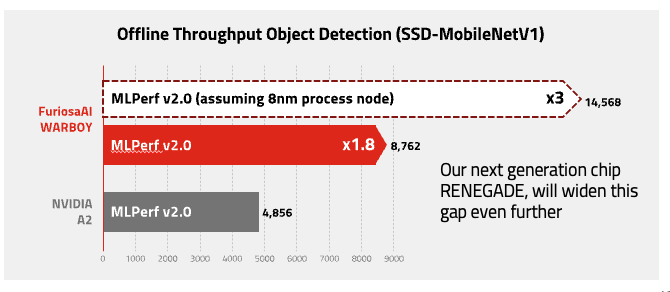

.. _Warboy:

**********************************
FuriosaAI Warboy
**********************************

FuriosaAI's first generation NPU Warboy is a chip with an architecture optimized for deep learning inference. It
demonstrates high performance for deep learning inference while maintaining cost-efficiency. FuriosaAI Warboy is
optimized for inferences with low batch sizes; for inference requests with low batch sizes, all of the chip's
resources are maximally utilized to achieve low latency. The large on-chip memory is also able to retain most major
CNN models, thereby eliminating memory bottlenecks, and achieving high energy efficiency.

Warboy supports key CNN models used in various vision tasks, including
Image Classification, Object Detection, OCR, Super Resolution, and Pose Estimation.
In particular, the chip demonstrates superior performance in computations such as depthwise/group convolution,
that drive high accuracy and computational efficiency in state-of-the-art CNN models.

Warboy delivers 64 TOPS performance and includes 32MB of SRAM.
Warboy consists of two processing elements (PE), which each delivers 32 TOPS performance and can be deployed independently.
With a total performance of 64 TOPS, should there be a need to maximize response speed to models, the two PEs may undergo fusion,
to aggregate as a larger, single PE. Depending on the users' model size or performance requirements the PEs may be 1) fused
so as to minimize response time, or 2) utilized independently to maximize throughput.

FuriosaAI SDK provides the compiler, runtime software, and profiling tools for the FuriosaAI Warboy.
It also supports the INT8 quantization scheme, used as a standard in TensorFLow and PyTorch, while providing tools to convert Floating Point models using Post Training Quantization.
With the FuriosaAI SDK, users can compile trained or exported models in formats commonly used for inference (TFLite or ONNX), and accelerate them on FuriosaAI Warboy.

HW Specifications
----------------------------------
The chip is built with 5 billion transistors, dimensions of 180mm^2, clock speed of 2GHz, and delivers peak performance of 64 TOPS of INT8.
It also supports a maximum of 4266 for LPDDR4x. Warboy has a DRAM bandwidth of 66GB/s, and supports PCIe Gen4 8x.

.. list-table:: Warboy Hardware Specification
   :align: center
   :widths: 200 300

   * - Peak Performance
     - 64 TOPS
   * - On-chip SRAM
     - 32 MB
   * - Host Interface
     - PCIe Gen4 8-lane
   * - Form Factor
     - | Full-Height Half-Length (FHHL)
       | Half-Height Half-Length (HHHL)
   * - Thermal Solution
     - | Passive Fan
       | Active Fan
   * - TDP
     - 40 - 60W (Configurable)
   * - Operating Temperature
     - 0 ~ 50℃
   * - Clock Speed
     - 2.0 GHz
   * - DDR Speed
     - 4266 Mbps
   * - Memory Type
     - LPDDR4X
   * - Memory Size
     - 16 GB (max. 32 GB)
   * - Peak Memory Bandwidth
     - 66 GB/s

.. _SupportedOperators:

List of Supported Operators for Warboy Acceleration
------------------------------

FuriosaAI Warboy and SDK can accelerate the following operators, as supported by
`Tensorflow Lite <https://www.tensorflow.org/lite>`_ model and `ONNX <https://onnx.ai/>`_.

The names of the operators use `ONNX`_ as a reference.

.. note::

    Any operators cannot be accelerated on Warboy, the operators will run on the CPU.
    For some operators, even if Warboy acceleration is supported, if certain conditions are not met, they may be split into several operators
    or may run on the CPU. Some examples of this would be when the weight of the model is larger than Warboy memory, or if the Warboy memory
    is not sufficient to process a certain computation.

.. list-table:: Operators Accelerated on Warboy
   :widths: 50 200
   :header-rows: 1

   * - Name of operator
     - Additional details
   * - `Add <https://github.com/onnx/onnx/blob/master/docs/Operators.md#Add>`_
     -
   * - `AveragePool <https://github.com/onnx/onnx/blob/master/docs/Operators.md#AveragePool>`_
     -
   * - `BatchNormalization <https://github.com/onnx/onnx/blob/master/docs/Operators.md#batchnormalization>`_
     - Acceleration supported, only if after Conv
   * - `Clip <https://github.com/onnx/onnx/blob/master/docs/Operators.md#clip>`_
     -
   * - `Concat <https://github.com/onnx/onnx/blob/master/docs/Operators.md#concat>`_
     - Acceleration supported, only for height axis
   * - `Conv <https://github.com/onnx/onnx/blob/master/docs/Operators.md#conv>`_
     - Acceleration supported, only for `group` <= 128 and dilation <= 12
   * - `ConvTranspose <https://github.com/onnx/onnx/blob/master/docs/Operators.md#convtranspose>`_
     -
   * - `DepthToSpace <https://github.com/onnx/onnx/blob/master/docs/Operators.md#depthtospace>`_
     -
   * - `Exp <https://github.com/onnx/onnx/blob/master/docs/Operators.md#exp>`_
     -
   * - `Expand <https://github.com/onnx/onnx/blob/master/docs/Operators.md#expand>`_
     -
   * - `Flatten <https://github.com/onnx/onnx/blob/master/docs/Operators.md#Flatten>`_
     -
   * - `Gemm <https://github.com/onnx/onnx/blob/master/docs/Operators.md#gemm>`_
     -
   * - `LeakyRelu <https://github.com/onnx/onnx/blob/master/docs/Operators.md#leakyrelu>`_
     -
   * - `LpNormalization <https://github.com/onnx/onnx/blob/master/docs/Operators.md#lpnormalization>`_
     -  Acceleration supported, only for p = 2 and batch <= 2
   * - `MatMul <https://github.com/onnx/onnx/blob/master/docs/Operators.md#matmul>`_
     -
   * - `MaxPool <https://github.com/onnx/onnx/blob/master/docs/Operators.md#maxpool>`_
     -
   * - `Mean <https://github.com/onnx/onnx/blob/master/docs/Operators.md#mean>`_
     -
   * - `Mul <https://github.com/onnx/onnx/blob/master/docs/Operators.md#mul>`_
     -
   * - `Pad <https://github.com/onnx/onnx/blob/master/docs/Operators.md#Pad>`_
     -
   * - `ReduceL2 <https://github.com/onnx/onnx/blob/master/docs/Operators.md#ReduceL2>`_
     -
   * - `ReduceSum <https://github.com/onnx/onnx/blob/master/docs/Operators.md#ReduceSum>`_
     -
   * - `Relu <https://github.com/onnx/onnx/blob/master/docs/Operators.md#Relu>`_
     -
   * - `Reshape <https://github.com/onnx/onnx/blob/master/docs/Operators.md#reshape>`_
     -
   * - `Pow <https://github.com/onnx/onnx/blob/master/docs/Operators.md#Pow>`_
     -
   * - `SpaceToDepth <https://github.com/onnx/onnx/blob/main/docs/Operators.md#SpaceToDepth>`_
     - Acceleration supported, only for mode="CRD" and Furiosa SDK version 0.6.0 or higher

   * - `Sigmoid <https://github.com/onnx/onnx/blob/master/docs/Operators.md#Sigmoid>`_
     -
   * - `Slice <https://github.com/onnx/onnx/blob/master/docs/Operators.md#slice>`_
     - Acceleration supported, only for height axis
   * - `Softmax <https://github.com/onnx/onnx/blob/master/docs/Operators.md#Softmax>`_
     - Acceleration supported, only for batch <= 2
   * - `Softplus <https://github.com/onnx/onnx/blob/master/docs/Operators.md#Softplus>`_
     -
   * - `Sub <https://github.com/onnx/onnx/blob/master/docs/Operators.md#sub>`_
     -
   * - `Split <https://github.com/onnx/onnx/blob/master/docs/Operators.md#Split>`_
     -
   * - `Sqrt <https://github.com/onnx/onnx/blob/master/docs/Operators.md#Sqrt>`_
     -
   * - `Transpose <https://github.com/onnx/onnx/blob/master/docs/Operators.md#Transpose>`_
     -
   * - `Unsqueeze <https://github.com/onnx/onnx/blob/master/docs/Operators.md#unsqueeze>`_
     -

MLPerf
------------------------------
Results submitted to MLPerf can be found at
`MLPerf™ Inference Edge v2.0 Results <https://mlcommons.org/en/inference-edge-20/>`_

\

See Also
=================================
* `MLPerf™ Inference Edge v1.1 Results <https://mlcommons.org/en/inference-edge-11/>`_
* `MLPerf™ Inference Edge v0.5 Results <https://mlcommons.org/en/inference-edge-05/>`_
