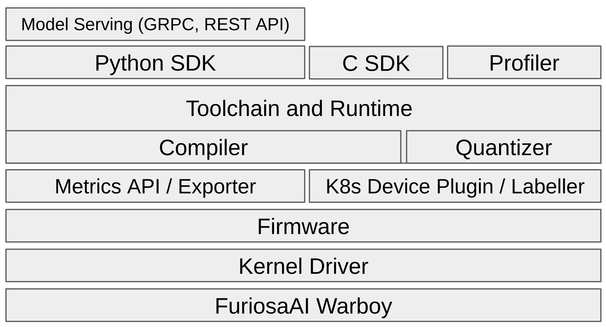

**********************************
FuriosaAI SW Stack Introduction
**********************************

FuriosaAI provides various SW components to allow the
NPU to be used in various applications and environments.
Here, we outline the SW stack provided by FuriosaAI, explaining
the roles of each component, together with guidelines and tutorials.

The above diagram demonstrates the SW stack provided by FuriosaAI, by layers.
At the lowest level is the :ref:`IntroToWarboy`, FuriosaAI's first generation NPU.

The following outlines the key components.

Kernel Driver and Firmware
=============================================================
The kernel driver allows the Linux operating system to
recognize the NPU device and acknowledge it as a Linux device file.
If the NPU is not recognized by the operating system, try reinstalling the driver.
The firmware provides a low-level API for the NPU device based on the NPU device file
recognized by the Linux operating system. The runtime and compiler control the NPU using the
low-level API provided by the firmware, thereby executing and scheduling tasks for inference on the NPU
using the compiled binary.

There is no need for the user to utilize kernel driver and firmware directly,
but they must be installed for Furiosa SDK to work. Installation guide can be found in :ref:`RequiredPackages`.

Compiler
====================================
The compiler plays a key role in optimizing DNN models and generating executable code in the NPU.
Currently, the compiler supports `TFLite <https://www.tensorflow.org/lite>`_ and `ONNX <https://onnx.ai/>`_ models,
and optimizes the models by introducing various latest research work and methods.

The compiler provided with :ref:`Warboy <IntroToWarboy>` supports NPU acceleration of various operators in the vision area.
For operators that are not supported with acceleration on NPU, the compiler compiles them such that the CPU will be utilized.

Additionally, the compiler not only accelerates major vision models such as ResNet50, SSD-MobileNet, and EfficientNet, but also models designed by the users so long as supported operators are utilized - to generate code optimized for NPU.

For reference, operators supported by NPU acceleration can be found in :ref:`SupportedOperators`.

The compiler is embedded within runtime, so users do not need to install it separately.
It can be used automatically in the process of creating a session through the Python/C SDK, or through :ref:`CompilerCli`.

Runtime
=====================================
Runtime analyzes the executable program generated by the compiler, and actually executes the
DNN model inference task as described in the program. During compilation, the DNN model inference is optimized,
and split into a number of smaller tasks running on NPU and CPU. Runtime is responsible for balancing the available resources, scheduling these tasks in accordance with the workload, and controlling the NPU via firmware for tasks being executed on the NPU.

Runtime functions are provided as APIs through the Python/C SDK, which will be described in the section below,
and installation instructions can be found in :ref:`RequiredPackages`.

Python SDK and C SDK
=====================================
Python and C SDK are packages that provide runtime functions as Python and C libraries as APIs, respectively.
They provide an APIs that create objects called 'session', that allows the specified model to infer using the designated device, and enables high-performance inference in a blocking and asynchronous manner.
If you need to write an application or service that utilizes the NPU, you can select and install one of the SDKs
according to the programming language of the application you are using.
Installation and usage of each SDK can be found in :ref:`PythonSDK` and :ref:`CSDK`.

Model quantizer API
=====================================
FuriosaAI SDK and :ref:`Warboy <IntroToWarboy>` support INT8 models, while models with
floating point data as weights undergo quantization, and can be used in :ref:`Warboy <IntroToWarboy>`.
To facilitate this quantization process, Furiosa SDK provides a Model quantizer API.
More information about the Model quantizer API provided by the Furiosa SDK can be found in :ref:`ModelQuantization`.

Model Server
=====================================
The model server exposes the DNN model as a GRPC or REST API.
Model formats such as `TFLite <https://www.tensorflow.org/lite>`_ and `ONNX <https://onnx.ai/>`_ contain within them the data type and tensor shape or the input/output tensors. Using this information, the models are exposed through the commonly used `Predict Protocol - Version 2 <https://github.com/kserve/kserve/blob/master/docs/predict-api/v2/required_api.md>`_.

With the model server, users do not need to directly access the NPU through the library and Python/C SDK, but can access it through a remote API.
In addition, horizontal scaling of services can be easily implemented by using multiple model servers serving the same model and using a load balancer.

The model server requires low latency and high throughput. Here, the scheduling function of the runtime is utilized.
Installation and utilization of the model server can be found in :ref:`ModelServing`.

Kubernetes Support
======================================
Kubernetes, a platform for managing containerized workloads and services, is popular with many enterprises.
FuriosaAI SW stack also provides native Kubernetes support.
Kubernetes Device Plugin enables the Kubernetes cluster to recognize FuriosaAI's NPUs
and schedule them for workloads/services that require the NPU.
This feature helps the allocation of resources when multiple workloads require NPU in a multi-tenant
environment such as Kubernetes, and enables efficient utilization of limited NPU resources.

Kubernetes Node Labeller adds the information of the physical NPU mounted
on the node, participating in Kubernetes, as metadata to the Kubernetes node object.

This function allows the user to identify information of the NPU mounted on the node using Kubernetes API or command line tool, and to distribute workload to nodes that satisfy certain conditions by utilizing the Pod's ``spec.nodeSelector`` or ``spec.nodeAffinity``.

Installation and usage instructions for NPU support in the Kubernetes environment can be found in the :ref:`KubernetesIntegration` page.