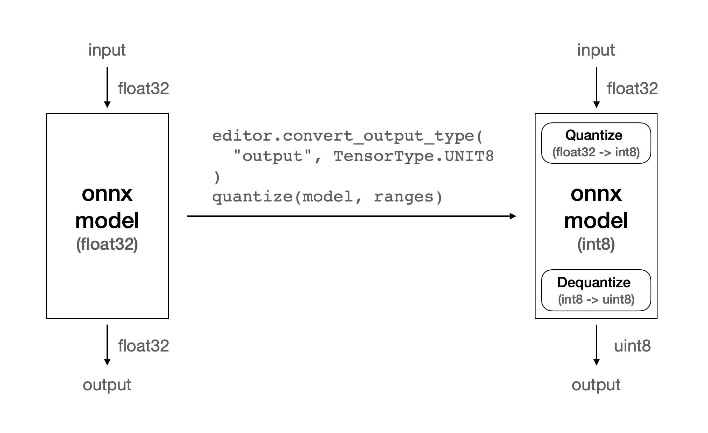

.. _PerformanceOptimization:

*************************************
Performance Optimization
*************************************

To ensure efficient inference serving in production,
it's essential to focus on throughput and latency as key metrics.
Furiosa SDK offers two optimization methods for both throughput and latency:

* **Model Optimization**: are ways to optimize models during the phases of model development,
  quantization, and compilation. Some optimization techniques may modify the models, leading to
  more efficient compiled programs.

* **Runtime Optimization**: are ways to optimize the runtime execution of compiled programs.
  They are about how to optimize inference codes through Runtime library depending
  on the characteristics of models workloads for higher throughput.

In this section, we will discuss the performance metrics and how to optimize them
in both above ways.

Performance Metrics: Latency and Throughput
==============================================================
*Latency* is one of the major performance evaluation criteria for model inference.
it's a measure of how long a single inference takes
from when the input data is passed to the model until the output value is received.
With low latency, users can experience high responsiveness.

Another performance evaluation criterion is throughput.
Throughput means the number of inferences that can be processed within a unit of time.
Throughput implies that how many requests a system handle simultaneously.

A single end-to-end inference consists of three kinds of operations: NPU execution, CPU computation
and IO operation between host and NPU device. Three kinds of operations run independently without blocking one another.
So, multiple inferences can run simultaneously while different operations run.
When we continue to run multiple requests simultaneously,
the longer operation among NPU, CPU, and IO operations is likely to determine the inference time.
This is because the shorter operations will be hidden by other longer operations.
This is a key characteristic to understand how to optimize the performance of a model.
You can find more details at :ref:`Concurrency Optimization <ConcurrencyOptimization>`.

NPU utilization is not a performance metrics, but it's one of the key metrics to indicate
how much the model utilizes a NPU device for inferences.
NPU utilization can be defined as the proportion of time the NPU is used during inference.
With NPU utilziation, we can evaluate how well the model is well-optimized for NPU acceleration.
Sometimes, it may also imply the room for further optimization opportunities.
Please refer to :ref:`Toolkit <Toolkit>` for how to measure NPU utilization.

Performance Profiling
--------------------------------------
To analyze the performance of a workload, we need to measure performance metrics as well as
we need to have a closer look at the times of NPU executions, CPU computations, and I/O operations.

For them, there are two useful tools in Furiosa SDK.

* :ref:`FuriosaBench` is a tool to measure the performance metrics such as latencies and
  throughput (i.e., QPS - queries per second).

* :ref:`Profiling` provides a way to measure the durations of NPU executions and other operations.

``furiosa-bench`` also provides ``--trace-output`` option to generate a trace file.
This is another easy way to measure the durations of NPU executions and other operations
from a running workload.

Model Optimization
======================================

In this seciton, we introduce some model optimization techniques to improve the performance
of models. They key idea of the model optimization is to identify the bottleneck parts
(usually operators) of the model and to reduce the times of the bottleneck parts or remove them.

For example, if some operators of a model are not accelerated by NPU,
they can be a major bottleneck. If you remove the operators or replace them with other equivalents,
the inference latency can be reduced significantly.

Optimizing ``Quantize`` Operator
-----------------------------------------
FuriosaAI's first-generation NPU, Warboy, supports only int8 type.
As the majority of deep learning models are built upon floating point types like fp32 and fp16,
to execute these models on Warboy,
a quantization step is necessary to convert the fp32 weights to int8 model weights.
In addition, the quantization step adds ``quantize``, ``dequantize`` operators to the
input and output parts of the model respectively.
``quantize`` and ``dequantize`` operators convert fp32 input values to int8 values and vice versa.
Those operators are executed on the CPU and are time-consuming.

Inputs of many CNN-based models are images. In particular, an image is represented as
RGB channels. In other words, a single image is composed of three images for each channel of RGB,
where each image is represented with 8-bit integer values, ranging from 0 to 255.

To feed an image to a model, we need to convert the ``int8`` values of each RGB channel
to ``fp32`` values, and ``quantize`` operator in the model converts ``fp32`` values
to ``int8`` values. It's unnecessary if we can feed RGB images in ``int8`` to a model directly.

To support this optimization, ``furiosa-quantizer`` provides the ``ModelEditor`` API.
``ModelEditor`` takes the model optimized by ``optimize_model()``.

.. code-block:: python

    model = onnx.load_model("yolox_l.onnx")
    model = optimize_model(model)

    editor = ModelEditor(model)

``convert_input_type()`` method of ``ModelEditor`` takes a tensor name and a data type as arguments.
It modifies the data type of the input tensor in the model to be the given arguments.
The target type can be either ``INT8`` or ``UINT8``. You can find the tensor name
through ``get_pure_input_names`` method.

.. code-block:: python

    input_tensor_name = get_pure_input_names(model)[0]

    # Convert this input tensor to uint8
    editor.convert_input_type(input_tensor_name, TensorType.UINT8)

As you can see in the above example, ``convert_input_type`` changes the data type of the input tensor to be ``uint8``.
The reason why we use ``uint8`` instead of ``int8`` is that the pixel values are represented as positive values.

Before this model modification, ``quantize`` operator converts ``float32`` values to ``int8`` values.
After this model modification, the quantize operator converts ``uint8`` values to ``int8`` values.
This conversion from ``uint8`` to ``int8`` is much faster than the conversion from ``float32`` to ``int8``.
The followings are the the benchmark results of before and after the model modification.
Also, the figure shows how the ``quantize`` operator is changed.

.. list-table:: Quantization in YOLOX_L
    :align: center
    :header-rows: 1

    * - Input type
      - ``Quantize`` execution time
    * - float32
      - 60.639 ms
    * - uint8
      - 0.277 ms

.. figure:: ../../../imgs/performance/quantize_0.png
  :class: with-border
  :align: center

  quantize without ``ModelEditor``

.. figure:: ../../../imgs/performance/quantize_1.png
  :class: with-border
  :align: center

  quantize with ``convert_input_type``

.. warning::

    This optmization may affect the accurarcy of the model.
    Since it depends on models and applications,
    it is recommended to validate the accuracy of the model.

The following is a real example code to use ``ModelEditor`` API with ``convert_input_type()``.

.. include:: ../../../../examples/optimization/model_input_type.py
    :code:

Optimizing ``Dequantize`` Operator
--------------------------------------

Similar to the above ``Quantize`` operator optimization,
``Dequantize`` operator also can be optimized in the similar way.

If the model output tensor is ``fp32``, the output of ``int8`` values must be converted to f32 values.
``Dequantize`` operator converts int8 values to fp32 values, and it's executed on CPU.
If the model output is an RGB image or something else which can be represented as ``int8`` or ``uint8`` values,
we can skip converting ``int8`` or ``uint8`` to ``fp32``. It will reduce the inference latency significantly.

We can enable this optimization by using ``convert_output_type()`` method of ``ModelEditor``.
``convert_output_type()`` method can modifies a model output by a given tensor name and a target data type.
The target type can be either ``INT8`` or ``UINT8``.

  quantize with ``convert_output_type``

.. figure:: ../../../imgs/performance/quantize_3.png
  :class: with-border
  :align: center

  quantize with ``convert_input_type`` and ``convert_output_type``

.. note::

    Furiosa Compiler may automatically apply this optimization
    to the model even if this optmization is not explicitly applied.
    In that case, the optimization by Furiosa Compiler may result in lower latency
    than the one manually applied by ``ModelEditor``.
    It is recommended to do experiments to find the best option.

.. warning::

    This optmization may affect the accurarcy of the model.
    Since it depends on models and applications,
    it is recommended to validate the accuracy of the model.

The following is an real example code to use ``convert_output_type`` option.

.. include:: ../../../../examples/optimization/model_output_type.py
    :code:

Lower/Unlower Acceleration
--------------------------------------
Warboy internally uses its inherent memory layout to accelerate the computation
by leveraging the NPU architecture.
For the memory layout, ``Lower`` operator reshapes the input tensor to the NPU's memory layout and
``Unlower`` operator reshapes the output tensor from the NPU's memory layout to the original shape.
For them, Furiosa Compiler automatically adds ``Lower`` and ``Unlower`` operators to the model.

In many cases, ``Lower`` and ``Unlower`` are executed on CPU, causing some overhead
of the inference latency.
However, if the last axis of input or output tensor shape is ``width`` and
the size of the last axis is a multiple of 32, ``Lower`` and ``Unlower`` operators can be accleerated on NPU.
Then, the inference latency can be reduced significantly.

Therefore, if you are able to specify the shape of the input and output tensors,
it's more optimal to use ``NxCxHxW`` and specify the width as a multiple of 32.
Also, this optimization can be applied independently to the input and output tensors respectively.

Removal of Pad/Slice
--------------------------------------

As described above, the ``Lower`` / ``Unlower`` operations can be accelerated
if the last axis of the tensor for either operator is `width` and
the size of the last axis is a multiple of 32.

If the last tensor axis of ``Lower`` is `width` but not a multiple of 32,
Furiosa Compiler may automatically add ``Pad`` operator before ``Lower`` operator
to adjust the size of the last axis to a multiple of 32.
In the similar way, Furiosa Compiler may automatically add ``Slice`` operator after ``Unlower`` operator to
slice data contents from the tensor with the last axis of a multiple of 32 to the original tensor shape.

This optimization gains some performance benefits by accelerating ``Lower`` / ``Unlower`` operations.
However, ``Pad`` and ``Slice`` requires CPU computation.
There's futher optimization opportunity to remove even ``Pad`` and ``Slice`` operators too.
If you can accept the constraints of the input and output tensor shapes,
it is strongly recommended using the shape of the tensors ``NxCxHxW`` and
a multiple of 32 of the width.

Change the Order of Input Tensor Axes at Compiler Time
---------------------------------------------------------------

As we discussed above, there are more optimization opportunities
if the last axis of the input tensor is ``width``.
However, changing the order of axes requires to modify the models.
It may require some effort to modify the original models in some cases.

So, Furiosa Compiler provides a way to change the order of the input tensor axes
at compile time. You can specify ``permute_input`` option in compiler config
to specify the new order of the input tensor axes as follows:

* ``compiler_config = { "permute_input": [[0, 3, 1, 2]] }``

    * The parameter of ``permute_input`` is the same as `torch.permute <https://pytorch.org/docs/stable/generated/torch.permute.html>`_.
    * For example, the above example code will change ``NxHxWxC`` to ``NxCxHxW``.

The following is a real example code to use ``permute_input`` option.

.. include:: ../../../../examples/optimization/permute_axis.py
    :code:

This is another case to use ``permute_input`` option.
In some cases, it's necessary to change the order of the input tensor axes
from ``NxCxHxW`` to ``NxHxWxC``.
Python OpenCV is a popular computer vision library.
``cv2.imread()`` of OpenCV returns a 3D NumPy array with ``HxWxC`` order.
If the axes of the input tensors of a model are ``NxCxHxW``, it requires to transpose the tensor.
The transpose is a time-consuming operation running in CPU.
In this case, we can remove the transpose operation
if we change the order of the input tensor axes of the model to the same as
OpenCV's output; e.g., ``NxHxWxC``. It will reduce the inference latency significantly.

Optimization of Large Input and Output Tensors
----------------------------------------------------

Some models have large images and as inputs and outputs. For example,
Denoising and super resolution models basically take large images as inputs and outputs.
Depending on your implementation, those models may be slow in Furiosa SDK and Warboy.
Furiosa Compiler optimizes the models with various techniques
while preserving the semantics of the original models.
Basically, Furiosa Compiler handles large tensors as defined by the model.
However, if the size of tensors is too large, it may exceed SRAM memory of Warboy,
causing more I/O operations between DRAM and SRAM. It may result in poor performance.

We can optimize this case by splitting a large tensor
into a number of smaller tensors and then merging the results.
Generally, we can apply this optimization to denosing and super resolution models
because the small parts of images can be independently processed and merged to get the final results.
The small parts of images are called patches, and the size of patches is called patch size.

To understand the optimization mechanism, we need to understand how the Furiosa Compiler works.
Furiosa Compiler tries to hide IO times between DRAM and SRAM by overlapping
them with NPU executions. In other words, NPU can execute operators while I/O operations are working.
If we split a large tensor into a number of smaller tensors,
the number of I/O operations can be hidden by NPU executions.

Once we decide to use this optimization, the next step is to determine the patch size.
Here, one good metric to determine the patch size is the ratio of the time spent on NPU executions.
The smaller the patch size, the more time is spent on NPU computation.
In contrast, the larger the patch size, the more time is spent on I/O operations.

Also, this optimization can be combined with using multiple NPU devices.
The multiple patches can run across multiple NPU devices in parallel.

More Batch, More NPU Utilization
----------------------------------------

For some models with small weights or few layers, the NPU utilization may be low.
In this case, we can increase the batch size to make the NPU utilization higher.
With this optimization, the inference may still have the same latency,
but its throughput can be increased significantly.

A batch size can be specified when compiling a model with ``--batch-size`` option as follows:

``furiosa-compiler --batch-size 32 --target-npu warboy mnist.dfg -o mnist.enf``

A batch size also can be specified when creating a session with ``batch_size`` option.
You can learn more about the ``batch_size`` option from
`Runner API <https://furiosa-ai.github.io/docs/v0.10.0/en/api/python/furiosa.runtime.html#furiosa.runtime.furiosa.runtime.Runtime.create_runner>`_.

Single PE vs Fusion PE
--------------------------------------

A single Warboy chip consists of two processing elements (PEs).
Each PE of Warboy has its own control unit, and the two PEs can work independently.
In this mode, each PE works with spatially-partitioned memory and processing units.
In contrast, two PEs can also be fused as a single PE.
In this fused mode, two PEs work as a single PE with an unified memory and processing units.

These two modes allow applications to have more flexibility to optimize the performance.
For example, if a model has large weights, we can use a 2PE-fused mode to load the weights
for a lower latency. If a model fits in a single PE, we can use two single PEs separately
to run the two model instances for higher throughput.

If a workload is latency-oriented, using a 2PE-fused mode is generally recommended.
If a workload is throughput-oriented, using two single PEs is generally recommended.
It still depends on models and workloads.
You need to find the optimal NPU configuration through experiments.

The followings are example commands to compile a model with a single PE or a fused-PE respectively.

* Single PE: ``furiosa-compiler --target-npu warboy resnet50.dfg -o resnet50.enf``
* Fusion PE: ``furiosa-compiler --target-npu warboy-2pe resnet50.dfg -o resnet50_2pe.enf``

This NPU configuration can also be specified
when creating a `Runtime <https://furiosa-ai.github.io/docs/v0.10.0/en/api/python/furiosa.runtime.html#furiosa.runtime.Runtime>`_
with ``device`` option which are specified by
`Device Configuration <https://furiosa-ai.github.io/docs/v0.10.0/en/api/python/furiosa.runtime.html#device-specification>`_

Runtime Optimization
======================================

So far, we have discussed the model optimization techniques to reduce the inference latency.
After we apply the model optimization, we can futher optimize the performance in Runtime level.

As we mentioned above, an end-to-end inference consists of three operations:
NPU execution, CPU computation, and IO operation.
Three kinds of operations can run independently without blocking one another.
They can be overlapped if we run multiple inferences simultaneously.
Leveraging this characteristic is a key idea of the runtime optimization.

.. _ConcurrencyOptimization:

More inference concurrency (the number of workers)
------------------------------------------------------------------------------

When we create a session through `Runner API <https://furiosa-ai.github.io/docs/v0.10.0/en/api/python/furiosa.runtime.html#furiosa.runtime.furiosa.runtime.Runtime.create_runner>`_,
we can specify the number of workers as an option.
A single worker is a unit that can run inferences independently sharing NPUs.
This concept is similar to a thread and CPUs.

If there is only one worker, multiple inference requests are processed sequentially through a single worker.
When one inference is completed, the next inference is processed by the owrker.
In this case, the NPU can be idle while the CPU is working, causing low NPU utilization.

.. figure:: ../../../imgs/performance/worker_single.png
  :alt: Single Worker
  :class: with-shadow
  :align: center
\

However, if there are multiple workers, the workers consume requests from the request queue
in Runtime. The multiple inferences can be processed simultaneously.
In this case, NPU executions are overlapped with CPU executions, possibly leading to higher NPU utilization.

.. figure:: ../../../imgs/performance/worker_multiple.png
  :alt: Multiple Workers
  :class: with-shadow
  :align: center
\

Each worker requires more memory resources to maintain context information for its execution.
If the number of workers is too large, the memory resources may be exhausted.
If the number of workers is too small, the NPU utilization may be low.
Finding the optimal number of workers is important to maximize the performance of the model.
Usually, we can find the optimal number of workers through experimentation.

Sync API vs Async APIs
--------------------------------------
There are two types of runtime APIs: Sync API and Async API.
Sync API is a blocking API that waits for the completion of the inference.
Async APIs are non-blocking APIs that don't wait for the completion of the inference.
Async APIs allow to request multiple inferences simultaneously and wait for the results asynchronously.

``furiosa.session.create()`` a creates a syncronous session.
As the below example, ``session.run()`` is blocked until the result is returned.
It generally is enough for batch workloads with large batch sizes,
but it's not sufficient for serving workloads that handle multiple current requests simultaneously.

.. code-block:: python

    from furiosa.runtime import session

    with session.create(model) as sess:
        input = ...
        outputs = sess.run(input) # Wait for completion
        ...

To overcome this limitation, Furiosa SDK provides two types of Async APIs: Queue API and Async/Await API.
They allow to request multiple inferences simultaneously and wait for the results asynchronously.
They are also useful to hide I/O and CPU computation by overlapping them with NPU executions.

Queue API
^^^^^^^^^^^^^^^^^^^^^^^^^^^^^^^^^^^^^^^

``create_async()`` creates a pair of a submitter and a queue.
With both, we can submit inference requests without waiting for completion and
wait for the inference results asynchronously.

.. include:: ../../../../examples/optimization/async_session.py
    :code:

Using Async/Await syntax
^^^^^^^^^^^^^^^^^^^^^^^^^^^^^^^^^^^^^^^

In the the example below, ``NPUModel`` of furiosa-server provide an easier way to implement
a serving application using async/await API.

.. include:: ../../../../examples/optimization/server_async_model.py
    :code:
