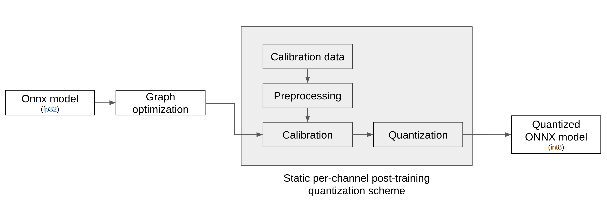

.. _ModelQuantization:

*************************************
모델 양자화
*************************************

FuriosaAI SDK와 1세대 Warboy는 8bit 정수형 모델을 지원한다.
실수형 데이터 타입 기반의 모델을 지원하기 위해 Furiosa SDK는 FP16, FP32 실수형 데이터 타입 기반 모델을 양자화(quantization)하여
8bit 정수형 데이터 타입 모델로 변환하는 도구를 제공한다.
양자화란 모델의 처리 성능을 높이거나 하드웨어를 가속하기 위해 사용되는 보편적인 기술로
FuriosaAI SDK에서 제공하는 양자화 도구를 사용하면 NPU를 활용하여 더욱 다양한 모델을 가속할 수 있다.

FuriosaAI SDK가 지원하는 양자화 방식은  *post-training 8-bit quantization* 기반이며
`Tensorflow Lite 8-bit quantization specification <https://www.tensorflow.org/lite/performance/quantization_spec>`_
을 따른다.

동작 방식
======================================

양자화 도구는 아래 그림에서 표현된 바와 같이 ONNX 모델을 입력으로 받아
아래 3단계를 거쳐 양자화를 실행하고 양자화된 ONNX 모델을 출력한다.

#. 그래프 최적화(Graph Optimization)
#. 보정(Calibration)
#. 양자화(Quantization)

그래프 최적화 과정에서는 모델이 양자화된 데이터를 정확도 저하를 최소화하면서 처리할 수 있도록
원본 모델 네트워크의 구조를 분석하여 모델에 연산자를 추가하거나 대체하여 그래프의 위상구조를 변경한다.

보정 과정에서는 데이터를 기반으로 모델의 가중치를 보정하며 이 과정에서
모델을 학습할 때 사용했던 데이터가 필요하다.

양자화 모델의 정확도
========================================

.. warning::

  WIP: 양자화가 보편적이고 많은 실제 상황에서 정확도가 많이 떨어지지 않는다는 것을 뒷받침할
  논문이나 문헌이 추가되면 좋을 듯

아래 표는 FuriosaAI SDK에서 제공하는 Quantizer를 이용해 각 모델의 검증용 데이터 셋으로
최소/최대 값보정 (Min-max calibration)을 이용하여 모델을 양자화 하고 정확도를 비교한 것이다.

.. _QuantizationAccuracyTable:

.. list-table:: Quantization Accuracy
   :widths: 50 50 50 50
   :header-rows: 1

   * - Model
     - FP Accuracy (%)
     - INT8 Accuracy (%)
     - Accuracy Drop (%)
   * - ResNet50 v1.0
     - 76.456
     - 76.002
     - 0.594
   * - SSD MobileNet 300x300
     - 22.137
     - 22.815
     - 1.392
   * - SSD Resnet34 1200x1200
     - 22.308
     - 22.069
     - 1.071

모델 양자화 APIs
========================================

SDK가 제공하는 API와 명령행 도구를 사용하여 ONNX 모델을 8bit 양자화 모델로 변환할 수 있다.
사용 방법은 아래에서 찾아볼 수 있다.

* `Python SDK 예제: 모델 생성 부터 인퍼런스 까지 <https://github.com/furiosa-ai/furiosa-sdk/blob/main/examples/notebooks/HowToUseFuriosaSDKFromStartToFinish.ipynb>`_
* `Python SDK Quantization 예제 <https://github.com/furiosa-ai/furiosa-sdk/tree/main/examples/quantizers>`_
* `Python 레퍼런스 - furiosa.quantizer <https://furiosa-ai.github.io/docs/v0.6.0/en/api/python/furiosa.quantizer.html>`_
