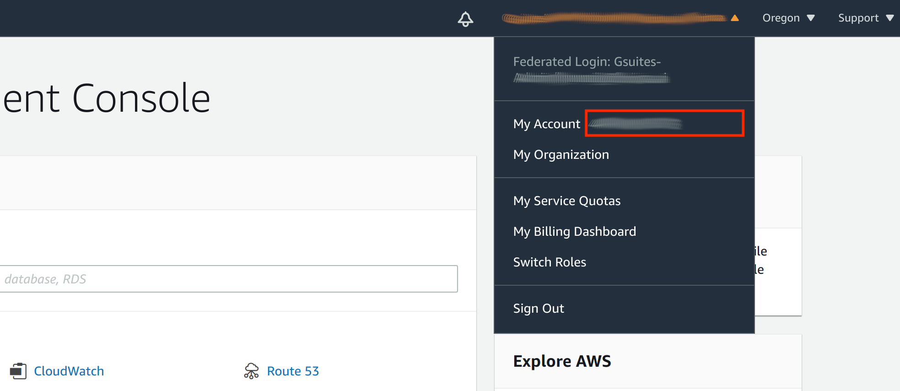

*************************************************
NPU 커널 드라이버 및 펌웨어 설치
*************************************************

FuriosaAI는 평가를 위한 환경 Alveo U250, AWS F1 에 대해 커널 드라이버 및 펌웨어를 제공한다.
평가 중인 환경에 맞게 아래 두 가지 중 알맞은 방식을 골라 설치를 진행한다.

  * :ref:`Alveo U250`
  * :ref:`AWS F1`

.. _Alveo U250:

Alveo U250 커널 드라이버 및 펌웨어 설치
****************************************

.. code-block::

  $ git clone https://github.com/furiosa-ai/furiosa-fpga-install.git
  $ cd furiosa-fpga-install
  $ sudo ./install_furiosa_fpga_u250

  Furiosa AI's F1 SDK has been successfully installed. 
  Please REBOOT this machine to complete the installation.

``furiosa-fpga-install`` 저장소에 포함된 ``check_fpga_device`` 명령어로
설치가 성공적으로 되었는지 확인할 수 있다.

.. code-block::

  $ cd furiosa-fpga-install
  $ ./check_fpga_device
  [OK] Furiosa AI's FPGA device is detected.

.. _AWS F1:

AWS F1 커널 드라이버 및 펌웨어 설치
****************************************

요구 사항
---------------------------------
* FuriosaAI에서 제공하는 평가용 AWS F1 FPGA 이미지 접근 권한이 필요 하다. AWS account ID를 Furiosa AI에게 공유하면 권한을 받을 수 있다.
* AWS F1 인스턴스가 필요하며 현재 f1.2xlarge 타입만 지원 하며, f1 인스턴스는 AWS의 일부 지역에서만 사용 가능하다. (예, `US East (N. Virginia)`)

FuriosaAI AWS F1 FPGA 이미지 접근 권한 획득 (AWS Account ID 전달)
--------------------------------------------------------------------
`AWS console <https://console.aws.amazon.com/>`_ 에 로그인 한 뒤에 우측 최상단 Account 이름을 클릭하면
팝업 창이 뜬다. My account 옆에 있는 빨간 박스에 위치한 12 자리 숫자 AWS Account ID 를 FuriosaAI에 전달한다.

설치
===================

``f1.2xlarge`` 인스턴스 생성후 인스턴스 내에서 아래 커맨드를 통해 커널 드라이버 및 펌웨어 설치 가능.

.. code-block::

  $ git clone https://github.com/furiosa-ai/furiosa-fpga-install.git
  $ cd furiosa-fpga-install
  $ sudo ./install_furiosa_fpga_aws_f1

  ...
  Furiosa AI's F1 SDK has been successfully installed. 
  Please REBOOT this machine to complete the installation.

``furiosa-fpga-install`` 저장소에 포함된 ``check_fpga_device`` 명령어로
설치가 성공적으로 되었는지 확인할 수 있다.

.. code-block::

  $ cd furiosa-fpga-install
  $ ./check_fpga_device
  [OK] Furiosa AI's FPGA device is detected.