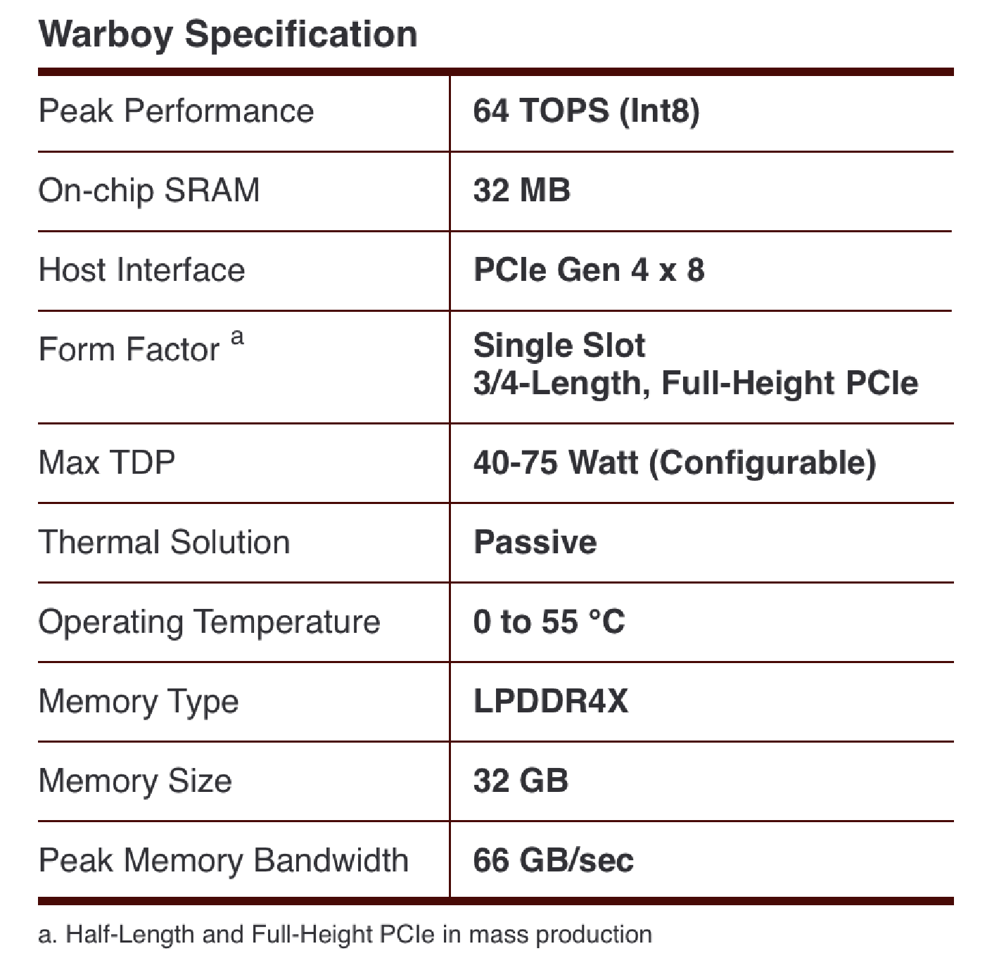

**********************************
FuriosaAI NPU
**********************************

FuriosaAI NPU는 딥러닝 추론에 최적화된 아키텍쳐로 설계된 칩으로,
적은 비용으로 높은 딥러닝 추론 성능을 보여준다.
FuriosaAI NPU는 작은 배치 크기의 추론에 최적화되어,
작은 배치 크기의 추론 요청에도 칩의 모든 자원을 최대로 활용하여 연산함으로써 낮은 응답속도를 달성한다.
또한 대용량 온칩 메모리는 주요 CNN 모델들을 온칩 메모리에 최대한 유지하여 메모리 병목을 제거하고,
높은 에너지 효율을 달성할 수 있도록 한다.

FuriosaAI NPU는 Image Classification, Object Detection, OCR, Super Resolution 등
다양한 Vision Task에 사용되는 주요 CNN 모델들을 지원하며,
특히 State-of-the-Art CNN 모델들에서 높은 정확도와 연산효율을 가능하게 하는
Depthwise/Group Convolution과 같은 연산에 대해서 차별화된 성능을 보여준다.

.. _IntroToWarboy:

**********************************
FuriosaAI Warboy
**********************************

FuriosaAI의 1세대 NPU인 Warboy는 64 TOPS의 성능과 32MB SRAM을 포함한다.
Warboy는 2개의 Processing Element (PE)로 구성되어, 각각 32 TOPS의 성능을 갖는
독립적인 디바이스로 사용할 수 있다. 전체 64 TOPS의 성능으로 모델의 응답속도를 극대화해야 하는 경우,
2개의 PE를 1개의 큰 PE로 Fusion하여 사용할 수 있다.
사용자의 모델의 크기 혹은 성능 요구 사항에 따라, 응답속도에 최적화하도록 Fusion하여 사용하거나
혹은 처리량에 최적화하기 위해 각 PE들을 독립적으로 사용하도록 구성할 수 있다.

FuriosaAI SDK는 FuriosaAI NPU를 위한 컴파일러, 런타임 소프트웨어 및 프로파일링 도구를 제공한다.
또한 TensorFlow, PyTorch에서 표준적으로 사용하는 INT8 Quantization Scheme을 지원하며,
Floating Point 모델들을 Post Training Quantization을 사용하여 변환할 수 있는 도구를 제공한다.
FuriosaAI SDK를 사용하여 추론을 위해 범용적으로 사용되고 있는 TensorFlowLite와 ONNX 포맷으로 훈련 또는
Export된 모델들을 컴파일하여 FuriosaAI NPU에서 가속할 수 있다.

FuriosaAI Warboy의 하드웨어 스펙
----------------------------------
5 billion transistor로 구성되어 있고, 180mm^2에 2GHz로 동작하고 INT8 기준 64 TOPS의 Peak Performance를 갖는다.
또한 LPDDR4x에 대해 최대 4266을 지원하며 66GB/s의 DRAM Bandwidth를 갖으며, PCIe Gen4 8x을 지원한다.

..
  for bottom margin of the above image

\

FuriosaAI Warboy의 성능
------------------------------
MLCommons 에 제출된 결과는
`MLPerf™ Inference Edge v2.0 Results <https://mlcommons.org/en/inference-edge-20/>`_ 에서
확인할 수 있다.

관련 문서
=================================
* `MLPerf™ Inference Edge v2.0 Results <https://mlcommons.org/en/inference-edge-20/>`_
* `MLPerf™ Inference Edge v1.1 Results <https://mlcommons.org/en/inference-edge-11/>`_