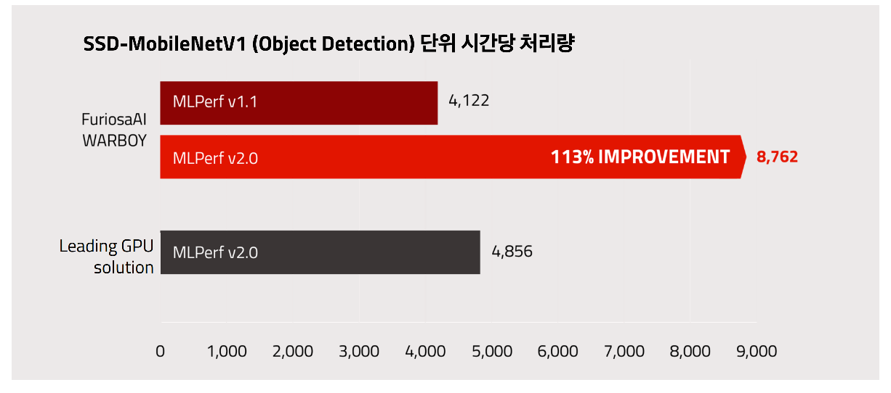

.. _Warboy:

**********************************
FuriosaAI Warboy
**********************************

FuriosaAI 1세대 NPU (Neural Processing Unit) Warboy는 딥러닝 추론에 최적화된 칩으로 적은 비용으로 높은 딥러닝 추론 성능을 낸다.
FuriosaAI Warboy는 작은 배치 크기의 추론 요청에도 칩의 모든 자원을 효율적으로 활용하여 낮은 응답속도 (latency)를 달성한다.
주요 CNN 모델들을 온칩 메모리에 최대한 저장하여 메모리 입출력에 사용하는 에너지를 최소화한다.

Warboy는 Image Classification, Object Detection, OCR, Super Resolution, Pose Estimation 등
다양한 Vision Task에 사용되는 주요 CNN 모델들을 지원한다.
State-of-the-Art CNN 모델에서 높은 정확도와 연산효율을 가능하게 하는 Depthwise/Group Convolution 같은 연산에서 월등히 차별화된 성능을 보여준다.

Warboy는 64 TOPS의 성능을 내고 32MB SRAM을 장착했다. Warboy는 2개의 PE (Processing Element)로 구성되어, 각각 32 TOPS의 성능을 갖는
독립적인 디바이스로 사용할 수 있다. 전체 64 TOPS의 성능으로 모델의 응답속도를 극대화해야 하는 경우에는 2개의 PE를 1개의 큰 PE로 fusion 하여 사용할 수 있다.
사용자의 모델 크기 혹은 성능 요구에 따라, fusion 하여 응답속도를 최소화 하거나 각 PE를 독립적으로 사용하여 처리량을 최대화 할 수 있다.

FuriosaAI SDK는 FuriosaAI Warboy를 위한 컴파일러, 런타임 소프트웨어 및 프로파일링 도구를 제공한다.
또한 TensorFlow, PyTorch에서 표준적으로 사용하는 INT8 Quantization Scheme을 지원하며,
Floating Point 모델들을 Post Training Quantization을 사용하여 변환할 수 있는 도구를 제공한다.
FuriosaAI SDK를 사용하여 추론을 위해 범용적으로 사용되고 있는 TFLite와 ONNX 포맷으로 훈련 또는
Export된 모델들을 컴파일하여 FuriosaAI Warboy에서 가속할 수 있다.

하드웨어 스펙
----------------------------------
5 billion transistor로 구성되어 있고, 180mm^2에 2GHz로 동작하고 INT8 기준 64 TOPS의 Peak Performance를 갖는다.
또한 LPDDR4x에 대해 최대 4266을 지원하며 66GB/s의 DRAM Bandwidth를 갖으며, PCIe Gen4 8x을 지원한다.

.. list-table:: Warboy Hardware Specification
   :align: center
   :widths: 200 300

   * - Peak Performance
     - 64 TOPS
   * - On-chip SRAM
     - 32 MB
   * - Host Interface
     - PCIe Gen4 8-lane
   * - Form Factor
     - | Full-Height Half-Length (FHHL)
       | Half-Height Half-Length (HHHL)
   * - Thermal Solution
     - | Passive Fan
       | Active Fan
   * - TDP
     - 40 - 60W (Configurable)
   * - Operating Temperature
     - 0 ~ 50℃
   * - Clock Speed
     - 2.0 GHz
   * - DDR Speed
     - 4266 Mbps
   * - Memory Type
     - LPDDR4X
   * - Memory Size
     - 16 GB (max. 32 GB)
   * - Peak Memory Bandwidth
     - 66 GB/s

..
  for bottom margin of the above image

\

.. _SupportedOperators:

가속 지원 연산자 목록
----------------------------------

FuriosaAI Warboy 및 SDK 에서는
`Tensorflow Lite <https://www.tensorflow.org/lite>`_ 모델과 `ONNX <https://onnx.ai/>`_ 가 지원하는
아래 연산자들을 가속할 수 있다. 연산자 이름은 `ONNX`_ 를 기준으로 한다.

.. note::

    Warboy에서 가속되지 않는 연산자는 CPU에서 수행된다.
    Warboy 가속 연산자라도 특정 조건을 만족하지 않을 경우는 다수의 연산자로 분할되어 Warboy에서 실행되거나 CPU 에서 실행될 수 있다.
    모델의 가중치가 Warboy 메모리 보다 크거나 특정 연산을 처리하기에 Warboy 메모리가 부족한 경우가 이에 해당한다.

.. list-table:: Warboy 가속 지원 연산자
   :widths: 50 200
   :header-rows: 1

   * - 연산자 이름
     - 추가 설명
   * - `Add <https://github.com/onnx/onnx/blob/master/docs/Operators.md#Add>`_
     -
   * - `AveragePool <https://github.com/onnx/onnx/blob/master/docs/Operators.md#AveragePool>`_
     -
   * - `BatchNormalization <https://github.com/onnx/onnx/blob/master/docs/Operators.md#batchnormalization>`_
     - Conv 다음에 있는 경우에 한하여 가속 지원
   * - `Clip <https://github.com/onnx/onnx/blob/master/docs/Operators.md#clip>`_
     -
   * - `Concat <https://github.com/onnx/onnx/blob/master/docs/Operators.md#concat>`_
     - H axis 지원 (>= 0.6.0), C axis 지원 (>= 0.7.0)
   * - `Conv <https://github.com/onnx/onnx/blob/master/docs/Operators.md#conv>`_
     - `group` <= 128, `dilation` <= 12 인 경우에 대해 지원
   * - `ConvTranspose <https://github.com/onnx/onnx/blob/master/docs/Operators.md#convtranspose>`_
     -
   * - `DepthToSpace <https://github.com/onnx/onnx/blob/master/docs/Operators.md#depthtospace>`_
     - CRD 모드 지원 (>= 0.6.0), DCR 모드 지원 (>= 0.7.0)
   * - `Exp <https://github.com/onnx/onnx/blob/master/docs/Operators.md#exp>`_
     - 0.7.0 이상 부터 지원
   * - `Elu <https://github.com/onnx/onnx/blob/main/docs/Operators.md#Elu>`_
     - 0.7.0 이상 부터 지원
   * - `Erf <https://github.com/onnx/onnx/blob/main/docs/Operators.md#Erf>`_
     - 0.7.0 이상 부터 지원
   * - `Expand <https://github.com/onnx/onnx/blob/master/docs/Operators.md#expand>`_
     -
   * - `Flatten <https://github.com/onnx/onnx/blob/master/docs/Operators.md#Flatten>`_
     -
   * - `Gemm <https://github.com/onnx/onnx/blob/master/docs/Operators.md#gemm>`_
     -
   * - `Gelu <https://github.com/microsoft/onnxruntime/blob/master/docs/ContribOperators.md#com.microsoft.Gelu>`_
     - 0.7.0 이상 부터 지원
   * - `LeakyRelu <https://github.com/onnx/onnx/blob/master/docs/Operators.md#leakyrelu>`_
     -
   * - `Log <https://github.com/onnx/onnx/blob/main/docs/Operators.md#Log>`_
     -
   * - `LpNormalization <https://github.com/onnx/onnx/blob/master/docs/Operators.md#lpnormalization>`_
     - p = 2 이고 batch <=2 인 경우에 한하여 지원
   * - `MatMul <https://github.com/onnx/onnx/blob/master/docs/Operators.md#matmul>`_
     -
   * - `MaxPool <https://github.com/onnx/onnx/blob/master/docs/Operators.md#maxpool>`_
     -
   * - `Mean <https://github.com/onnx/onnx/blob/master/docs/Operators.md#mean>`_
     -
   * - `Mul <https://github.com/onnx/onnx/blob/master/docs/Operators.md#mul>`_
     -
   * - `Pad <https://github.com/onnx/onnx/blob/master/docs/Operators.md#Pad>`_
     - CWH axis 지원 (>= 0.7.0)
   * - `ReduceL2 <https://github.com/onnx/onnx/blob/master/docs/Operators.md#ReduceL2>`_
     -
   * - `ReduceSum <https://github.com/onnx/onnx/blob/master/docs/Operators.md#ReduceSum>`_
     -
   * - `Relu <https://github.com/onnx/onnx/blob/master/docs/Operators.md#Relu>`_
     -
   * - `Reshape <https://github.com/onnx/onnx/blob/master/docs/Operators.md#reshape>`_
     -
   * - `Resize <https://github.com/onnx/onnx/blob/master/docs/Operators.md#Resize>`_
     - Linear, Nearest 모드 지원 (>= 0.7.0)
   * - `Pow <https://github.com/onnx/onnx/blob/master/docs/Operators.md#Pow>`_
     -
   * - `SpaceToDepth <https://github.com/onnx/onnx/blob/main/docs/Operators.md#SpaceToDepth>`_
     - CRD 모드 지원 (>= 0.6.0), DCR 모드 지원 (>= 0.7.0)
   * - `Sigmoid <https://github.com/onnx/onnx/blob/master/docs/Operators.md#Sigmoid>`_
     -
   * - `Slice <https://github.com/onnx/onnx/blob/master/docs/Operators.md#slice>`_
     - H axis 지원 (>= 0.6.0), C axis 지원 (>= 0.7.0)
   * - `Softmax <https://github.com/onnx/onnx/blob/master/docs/Operators.md#Softmax>`_
     - batch <= 2 인 경우에 한해 지원
   * - `Softplus <https://github.com/onnx/onnx/blob/master/docs/Operators.md#Softplus>`_
     -
   * - `Sub <https://github.com/onnx/onnx/blob/master/docs/Operators.md#sub>`_
     -
   * - `Split <https://github.com/onnx/onnx/blob/master/docs/Operators.md#Split>`_
     -
   * - `Sqrt <https://github.com/onnx/onnx/blob/master/docs/Operators.md#Sqrt>`_
     -
   * - `Tanh <https://github.com/onnx/onnx/blob/main/docs/Operators.md#Tanh>`_
     - 0.7.0 이상 버전 부터 지원
   * - `Transpose <https://github.com/onnx/onnx/blob/master/docs/Operators.md#Transpose>`_
     - 0.6.0 이상 버전 부터 지원
   * - `Unsqueeze <https://github.com/onnx/onnx/blob/master/docs/Operators.md#unsqueeze>`_
     -

MLPerf 성능
---------------------------------

MLPerf 에 제출된 결과는
`MLPerf™ Inference Edge v2.0 Results <https://mlcommons.org/en/inference-edge-20/>`_ 에서
확인할 수 있다.

\

관련 문서
=================================
* `MLPerf™ Inference Edge v1.1 Results <https://mlcommons.org/en/inference-edge-11/>`_
* `MLPerf™ Inference Edge v0.5 Results <https://mlcommons.org/en/inference-edge-05/>`_
