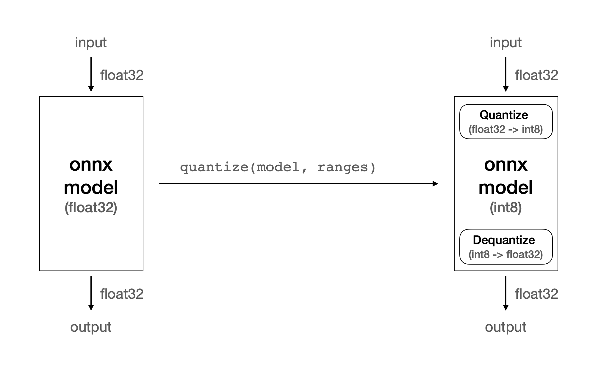
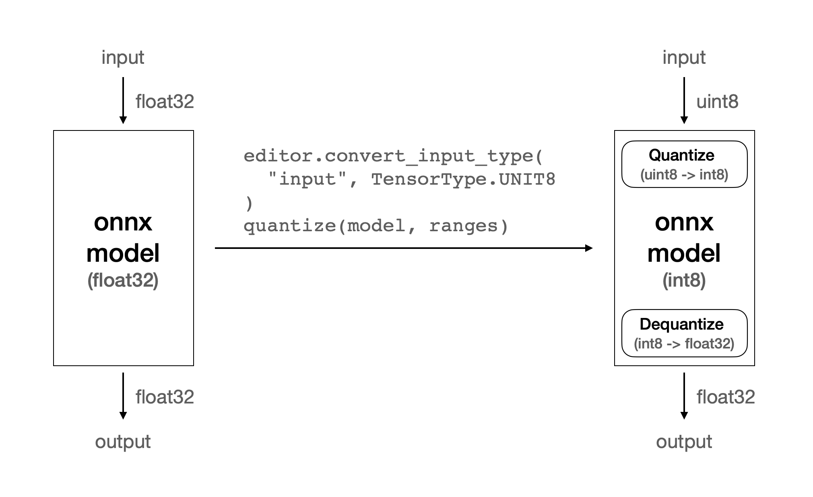

.. _PerformanceOptimization:

*************************************
성능 최적화
*************************************

FuriosaAI SDK를 이용해 NPU에서 모델을 추론할 수 있음을 확인하면, 이를 더욱 효율적으로 동작할 수 있도록 최적화 작업을 수행할 수 있다.

성능을 향상시키기 위한 최적화 작업은 크게 두 가지 기법으로 분류할 수 있다.
양자화 및 컴파일 단계에서 모델을 최적화하여 추론 시간을 최소화하는 *모델 최적화* 기법과,
모델과 워크로드의 특성을 고려하여 런타임이 효율적으로 실행되도록 개선하는 *런타임 최적화* 기법이 있다.

이 문서에서는 성능을 평가하는 기준과 분석 방법을 소개하고 각 최적화 기법을 설명한다.

성능 평가 요소: 지연 시간과 처리량
======================================

모델 추론에 대한 주된 성능 평가 요소로 *지연 시간* (latency)이 있다.
지연 시간은 모델에 입력 데이터를 전달했을 때, 출력값을 받을 때까지 걸리는 시간을 의미한다.
즉 하나의 작업 결과를 받기 위해 얼마나 기다려야 하는지를 측정하는 지표이다.
지연 시간은 사용자 경험에 큰 영향을 주며, 지연 시간이 작은 시스템은 빠르게 응답을 되돌려주고 사용자는 높은 반응성을 느끼게 된다.

또 다른 성능 평가 요소로 *처리량* (throughput)이 있다.
처리량은 단위 시간 동안 처리할 수 있는 추론의 횟수를 의미한다.
즉 처리량은 여러 개의 작업 결과를 시스템이 얼마나 빠르게 처리할 수 있느냐를 측정하는 지표이다.
처리량이 높은 시스템은 동시에 많은 요청을 처리하거나 대규모 데이터를 처리해야 하는 경우에 유용하다.

FuriosaAI SDK를 이용하여 추론할 때에는 추가로 고려해야 할 사항이 있다.
그것은 추론이 진행되는 시간 속에는 NPU에서 소모하는 시간 외에도 CPU 연산 또는 I/O에 사용되는 시간이 추가된다는 점이다.
그리고 NPU 자체의 시간과 그 밖의 시간은 서로 독립적이기 때문에 여러 추론 요청을 동시에 처리할 수 있다는 사실이 계산에 반영되어야 한다.
따라서 NPU 자체의 시간 또는 그 밖의 시간 중 더 긴 쪽을 추론 1회시 필요한 시간으로 간주하고 처리량을 계산할 수 있다.
다만 이는 이상적인 상황에서 산술적으로만 계산을 한 것이고, 현실적인 값을 확인하기 위해서는 부하 테스트를 통해 실제 처리량을 관찰해 보는 것이 필요하다.
이 내용에 대해서는 이 문서의 :ref:`Worker 수 최적화 <ConcurrencyOptimization>` 항목에서 자세히 설명한다.

모델의 성능에 대해 평가하는 기준에는 *정확도* (accuracy)도 포함된다.
그러나 이 문서에서는 정확도의 측정 및 개선과 관련된 부분은 다루지 않는다.
이 내용에 대해서는 :ref:`모델 양자화 문서 <ModelQuantization>` 에서 다루고 있다.

성능을 평가하는 직접적인 대상은 아니지만, *NPU 사용률* (NPU utilization)도 성능과 밀접한 연관이 있다.
NPU 사용률은 추론이 진행되는 시간 동안 NPU를 사용하는 시간의 비율로 나타낸다. 즉, NPU를 충분히 활용하고 있는지를 나타내는 지표이다.
NPU 사용률 지표를 통해 모델이 NPU에서 잘 가속되도록 최적화되었는지, 추론을 실행하는 프로그램이 적절히 작성되었는지 등을 판단할 수 있다.
또한 이 값으로부터 추가적인 최적화 가능성을 가늠할 수도 있다.
NPU 사용률을 확인할 수 있는 방법은 :ref:`명령행 도구 문서 <Toolkit>` 에서 다루고 있다.

성능 프로파일링
--------------------------------------

워크로드의 성능을 분석하기 위해서는 NPU를 포함하여 런타임의 상세한 동작 상황을 알 수 있어야 한다.
런타임이 어떻게 동작하는지 파악하기 위해 프로파일러를 유용하게 사용할 수 있다.

프로파일러의 자세한 사용 방법은 :any:`성능 프로파일링 문서 <Profiling>` 에서 다루고 있다.

모델 최적화
======================================

모델 최적화 과정을 통해 지연 시간을 줄일 수 있다.

지연 시간은 여러 요인에 의해 결정된다.
그중 높은 비율을 차지하는 것은 CPU에서 실행되는 연산들이다.

보통 모델을 컴파일하면 NPU 추론 요청에 대한 전후 처리 또는 NPU에서 처리할 수 없는 연산들을 위한 CPU에서 실행되는 연산자들이 별도로 생기는데,
이들이 병목 현상을 일으켜 NPU 사용률을 저하시키는 주범이 된다.

따라서 이러한 연산자들을 최대한 제거하거나 연산 시간을 줄이는 것이 모델 최적화의 주된 목표이다.

Quantize 연산 최적화
--------------------------------------

FuriosaAI의 1세대 NPU인 Warboy는 int8 정수 연산만 지원한다.
대다수의 딥러닝 모델은 부동 소수점, 특히 float32를 기반으로 만들어지고 있기에
이러한 모델들을 Warboy에서 실행하기 위해서는 부동 소수점의 값을 정숫값으로 변환하는 작업을 수행해야 한다.
이 작업은 CPU에서 처리하는데, 많은 시간을 소모하는 연산이다.

한편, 많은 이미지 프로세싱 모델들은 입력값으로 이미지를 받는다.
일반적으로 이미지는 RGB 채널에 대해 8비트 정수 범위의 값들로 구성되어 있다.
따라서 이미지 정숫값을 부동 소수점으로 변환하고, 이를 모델의 입력값으로 전달하면 다시 정숫값으로 변환하는 불필요한 작업을 수행하게 된다.

정수로 표현되는 RGB 이미지의 값을 모델의 입력으로 바로 받을 수 있다면 부동 소수점과 정수 사이의 형 변환 없이 추론을 시작할 수 있으므로 시간을 절약할 수 있다.
이러한 최적화를 지원하기 위해서 Furiosa SDK의 양자화 도구인 furiosa-quantizer 에서 ``ModelEditor`` API를 제공한다.
양자화 단계에서 ``optimize_model`` 함수를 호출하여 반환된 모델을 ``ModelEditor`` 에 전달하면 모델을 편집할 수 있는 editor를 생성할 수 있다.

.. code-block:: python

    model = onnx.load_model("yolox_l.onnx")
    model = optimize_model(model)

    editor = ModelEditor(model)

``ModelEditor`` 의 API 중 ``convert_input_type`` 함수를 호출하여 모델 입력 텐서의 자료형을 변경할 수 있다.
``convert_input_type`` 함수의 첫 번째 인자는 입력 텐서의 이름을 받고, 두 번째 인자는 변경하고 싶은 대상 자료형을 받는다.
대상 자료형으로 ``INT8`` 과 ``UINT8`` 중 하나를 사용할 수 있다.

만약 입력 텐서의 이름을 알지 못한다면 ``get_pure_input_names`` 함수를 이용해 확인할 수 있다.

.. code-block:: python

    input_tensor_name = get_pure_input_names(model)[0]

    # input 텐서의 자료형을 uint8로 변환
    editor.convert_input_type(input_tensor_name, TensorType.UINT8)

위와 같이 ``convert_input_type`` 를 호출하면 모델의 입력 텐서 자료형이 float32에서 uint8로 변경된다.
int8이 아닌 uint8을 사용한 이유는 픽셀 값이 양수로 표현되기 때문이다.

``convert_input_type`` 을 사용하기 전에는 float32에서 int8로 형 변환을 처리하는 ``Quantize`` 연산이 생겼던 반면,
적용 후에는 uint8에서 int8로 형 변환되는 ``Quantize`` 연산이 생긴다.
이때 uint8에서 int8로의 변환은 float32에서 int8로의 변환에 대비하여 빠른 속도로 처리된다.

.. list-table:: Quantization in YOLOX_L
    :align: center
    :header-rows: 1

    * - Input type
      - ``Quantize`` 연산 시간
    * - float32
      - 60.639 ms
    * - uint8
      - 0.277 ms

  quantize without ``ModelEditor``

  quantize with ``convert_input_type``

.. warning::

    float32 타입의 값을 모델의 입력으로 받아 이를 Quantize 연산을 통해 정수로 변환할 때와
    uint8 타입의 값을 모델의 입력에서 바로 사용할 때의 값이 서로 일치하지 않을 수 있다.
    이는 추론 시 정확도에 영향을 미칠 수 있으므로 반드시 검증이 필요하다.

실행할 수 있는 전체 예제는 다음 코드를 참고할 수 있다.

.. include:: ../../../../examples/optimization/model_input_type.py
    :code:

Dequantize 연산 최적화
--------------------------------------

``Quantize`` 연산이 모델의 입력에 관한 것이었다면, ``Dequantize`` 연산은 모델의 출력과 관련이 있다.

모델의 출력 텐서 자료형이 float32이면 NPU 연산의 결과로 산출된 int8의 값을 float32로 형 변환하는 작업을 수행해야 한다.
이 과정 역시 CPU가 처리하고 ``Quantize`` 와 마찬가지로 많은 시간을 소모하게 된다.

만약 모델의 출력이 RGB 형태로 표현되는 이미지이거나,
정수 범위 내에서도 적절한 값으로 활용할 수 있는 출력 형식이라면
float32로의 변환 후 반환하는 대신 int8 또는 uint8 값으로 반환할 수 있다.

이 최적화 역시 위에서 소개한 ``ModelEditor`` API를 사용하여 수행할 수 있다.
``ModelEditor`` 의 API 중 ``convert_output_type`` 함수를 호출하여 모델 출력 텐서의 자료형을 변경할 수 있다.
``convert_output_type`` 함수의 첫 번째 인자는 출력 텐서의 이름을 받고, 두 번째 인자는 변경하고 싶은 대상 자료형을 받는다.
대상 자료형으로는 ``INT8`` 과 ``UINT8`` 중 하나를 사용할 수 있다.

.. figure:: ../../../imgs/performance/quantize_2.png
  :class: with-border
  :align: center

  quantize with ``convert_output_type``

.. figure:: ../../../imgs/performance/quantize_3.png
  :class: with-border
  :align: center

  quantize with ``convert_input_type`` and ``convert_output_type``

.. note::
  
    모델에 따라 이 기능을 사용하지 않는 경우에도 컴파일러가 내부적으로 최적화를 수행하는 경우도 있다.
    이때는 이 옵션을 적용하는 것보다 더 좋은 성능을 가질 수도 있으므로
    반드시 실험을 통해 옵션의 차이를 비교해 보고 더 최적화가 잘 된 쪽을 선택하는 것을 권장한다.

.. warning::
  
    추론을 마친 후 반환되는 정수 타입의 값을 곧바로 모델의 출력값으로 사용하는 것과
    그 값을 float32 타입으로 dequantize 한 값을 모델의 출력값으로 사용하는 것에는
    후처리 등에서 값을 사용하는 방법에 따라 정확도에 영향을 미칠 수 있으므로 반드시 검증이 필요하다.

실행할 수 있는 전체 예제는 다음 코드를 참고할 수 있다.

.. include:: ../../../../examples/optimization/model_output_type.py
    :code:

Lower/Unlower 가속
--------------------------------------

컴파일러는 입력 텐서가 NPU에게 전달되기 전, NPU에서 연산(특히 Convolution)이 효율적으로 가속될 수 있도록 텐서의 모양을 변형시키는 연산자를 추가한다.
이를 ``Lower`` 연산이라고 한다. 그리고 NPU의 연산이 끝나고 변형되었던 텐서를 본래 모델이 의도했던 출력 텐서의 모양으로 되돌리는 것을 Unlower 연산이라고 한다.
Lower와 Unlower는 주로 transpose와 padding, slice 등의 연산으로 이루어지는데 이 과정이 CPU에서 이루어지므로 여기서도 적지 않은 시간을 소모하게 된다.

그런데 ``Lower`` 연산의 입력 텐서 또는 ``Unlower`` 연산의 출력 텐서가 특정 조건이 만족되면 이 연산들을 CPU에서 실행하지 않고 NPU에서 실행하여 가속을 시킬 수 있다.
이 경우 NPU의 소요 시간이 조금 늘어나지만 CPU에서 사용하는 시간이 큰 폭으로 줄어들기에 지연 시간을 개선시키는 데에 효과를 볼 수 있다.

Warboy는 **마지막 축이 width이고 해당 축의 크기가 32의 배수인 텐서** 에 대하여
``Lower`` 및 ``Unlower`` 연산의 가속을 지원한다.
모델의 입력 또는 출력이 이미지인 경우 텐서의 모양이 ``NxCxHxW`` 일 때가 많은데,
이 경우 최적화가 적용되므로 ``Lower`` 또는 ``Unlower`` 연산이 가속된다.

Pad/Slice 제거
--------------------------------------

위에서 설명한 것과 같이 ``Lower`` / ``Unlower`` 연산을 가속할 수 있지만,
이를 위해서는 마지막 축이 width인 것과 함께 해당 축의 크기가 32의 배수이어야 한다.
만약 32의 배수가 아니라면 이 연산들은 NPU에서 가속될 수 없다.

Furiosa SDK의 컴파일러는 ``Lower`` / ``Unlower`` 연산에 사용되는 텐서의 마지막 축이 width라면,
축의 크기가 32의 배수가 아니더라도 가속을 유도하기위한 최적화를 적용한다.

``Lower`` 의 경우 ``Pad`` 연산을 추가하여 텐서 마지막 축의 크기가 32의 배수가 되도록 최적화를 시도한다.
``Unlower`` 의 경우 ``Pad`` 또는 최적화 된 NPU 연산에 의해 덧붙은 텐서의 일부를 제거하기위해
``Slice`` 연산을 추가하여 본래의 출력 텐서 모양으로 변환시킨다.

그러나 최적화 관점에서는 ``Pad`` 나 ``Slice`` 모두 CPU에서 수행하는 연산들이므로,
생략할 수 있다면 연산을 하지 않는 것이 좋다.
모델의 입력 또는 출력 텐서의 모양과 크기를 임의로 지정하는 것이 가능하다면,
각 텐서의 모양은 ``NxCxHxW`` 가 되고 width의 크기가 32의 배수가 되는 모델을 만들 수 있으면
NPU에서 효율적으로 동작할 가능성이 높아진다.

입력 텐서의 축 순서 변경
--------------------------------------

모델의 입력으로 ``NxHxWxC`` 등 마지막 축이 width가 아닌 경우가 있다.
이 경우에는 ``Lower`` 연산을 생략할 수 없다. 이때 성능 최적화를 시도해보고싶다면,
컴파일 단계에서 ``permute_input`` 옵션을 지정하여 원본 모델의 축 순서를 임의로 변경해볼 수 있다.

* ``compiler_config = { "permute_input": [[0, 3, 1, 2]] }``

    * ``permute_input`` 의 sequence 순서는 `torch.permute <https://pytorch.org/docs/stable/generated/torch.permute.html>`_ 와 같은 방법으로 기술한다.
    * 위 예시에서는 ``NxHxWxC`` 가 ``NxCxHxW`` 로 변경된다.

실행할 수 있는 전체 예제는 다음 코드를 참고할 수 있다.

.. include:: ../../../../examples/optimization/permute_axis.py
    :code:

Lower의 제거를 위해 ``NxHxWxC`` 를 ``NxCxHxW`` 로 변경할 수 있지만, 반대로 ``NxCxHxW`` 를 ``NxHxWxC`` 로 바꾸는 경우도 있다.

이미지 로드를 위해 많이 사용하는 Python OpenCV에서 ``cv2.imread()`` 를 호출하면
그 결과로 3차원 NumPy 배열을 반환하는 데 이를 텐서로 변환하면 ``HxWxC`` 순서가 된다.
모델의 입력 텐서가 ``NxHxWxC`` 라면 이 텐서를 곧바로 입력값으로 전달할 수 있지만,
``NxCxHxW`` 순서라면 transpose를 해야 하기 때문에 추가적인 연산이 필요하다.
따라서 이미지 로드 후 ``CxHxW`` 로의 transpose에 시간이 많이 소요된다면,
모델의 입력을 ``NxHxWxC`` 로 바꾸어 transpose를 생략하는 방식으로 응용할 수 있다.

텐서의 크기가 큰 모델의 최적화
--------------------------------------

NPU가 연산을 효율적으로 실행하기 위해서는 I/O보다 연산을 위해 사용하는 시간이 더 많은 것이 좋다.
만약 모델이 다루고 있는 텐서들의 크기가 지나치게 클 경우 NPU 하드웨어의 메모리 제약을 초과하여 컴파일이 실패하거나,
컴파일은 될지라도 NPU 추론 과정에서 지나치게 많은 I/O가 발생하여 좋지 않은 성능으로 추론을 실행하게 되는 상황이 생길 수 있다.

텐서의 크기가 지나치게 커서 I/O에 오버헤드가 많이 발생한다면, 텐서의 크기를 줄이는 것이 방법이 될 수 있다.
즉, 주어진 이미지를 더 작은 이미지로 쪼개어서 여러 번에 나누어 추론한 뒤, 연산한 결과를 합치는 기법을 적용할 수 있다.
대표적으로 Denoising, Super Resolution 계열의 모델들은 이미지의 일부를
독립적으로 추론해도 유효한 결과를 얻을 수 있기 때문에이 방법이 가능하다.
이때 나뉘어진 부분 이미지를 패치, 그리고 부분 이미지의 크기를 패치 사이즈 라고 한다.

모델을 패치 최적화로 분할하기로 하면, 다음 단계는 패치 사이즈를 결정하는 것이다.
패치 사이즈는 NPU가 동작하는 시간 중 연산에 드는 시간의 비율이 높을 수록 좋다.
Warboy가 한 번에 처리할 수 있는 이미지의 크기에는 제한이 있으므로,
패치 사이즈가 크면 반복적인 I/O로 많은 시간을 소비하고,
패치 사이즈가 작으면 패치 이미지 주변의 패딩 영역의 비율이 높아져 오버헤드가 발생한다.
적정한 패치 크기를 실험으로 찾으면, 입력 이미지를 쪼개어 추론을 수행한 뒤
결과를 이어붙여 원하는 추론을 완료할 수 있다.
또한 다수의 Warboy를 활용할 수 있다면 병렬 처리를 통해 지연 시간을 단축할 가능성도 존재한다.

간단한 네트워크로 구성된 모델의 최적화
----------------------------------------

만약 네트워크가 간단해 적은 수의 레이어로 구성되거나, 다루는 텐서의 크기가 작은 모델인 경우 NPU를 효율적으로 사용하기 어렵다.
NPU가 추론 가속을 위해 수행하는 병렬 연산을 충분히 활용할 수 없기 때문이다.
오히려 NPU가 수행하는 연산 시간보다 CPU의 연산 시간 또는 I/O 시간이 더 길어진다.

이러한 경우에는 의도적으로 배치 크기를 늘림으로써 텐서의 크기를 키워 균형을 맞추는 방법이 있다.
모든 상황에서 적용 가능한 것은 아니지만, 추론을 빈번하게 수행해야 되는 워크로드, 즉 높은 처리량을 필요로 하는 환경에서 유효하게 사용될 수 있다.

지연 시간은 같거나 조금 늘어나게 되지만, 같은 시간 동안 처리할 수 있는 추론 횟수를 증가시킬 수 있다.

``furiosa-compiler --batch-size 32 --target-npu warboy mnist.dfg -o mnist.enf``

단, 배치 크기만큼의 입력을 모두 채우지 못하는 상황이 빈번한 워크로드인 경우,
불필요한 오버헤드만 생기게 되므로 이 방법은 적합한 워크로드에서만 사용하는 것을 권장한다.

Single PE vs Fusion PE
--------------------------------------

Warboy는 Processing Element(이하 PE)라고 부르는 Core가 두 개 있다.
두 PE를 독립적인 장치로 놓고 각각을 따로 사용하는 방식을 Single PE라고 부르고,
두 PE를 논리적으로 하나의 장치인 것처럼 사용하는 방식을 Fusion PE라고 한다.

Single PE는 하나의 NPU에서 사용할 수 있는 자원을 절반씩 나누어 사용하기 때문에 Fusion PE에 비해 상대적으로 처리 속도가 느릴 수 있으나,
각각을 독립적으로 사용할 수 있기에 병렬성이 필요한 환경에서 유용하게 쓰일 수 있다.

Fusion PE는 하나의 NPU에 있는 하드웨어 연산기나 메모리를 모두 사용하기에 한 번에 많은 연산을 처리할 수 있어 Single PE보다 빠르게 추론을 수행할 수 있다.

워크로드의 특성에 있어서 지연 시간이 중요하다면 Fusion PE를 사용하고,
처리량이 중요하다면 두 개의 Single PE로 나누어 사용하는 것이 좋다.

단, 처리량 위주의 워크로드라 할지라도 실행 패턴에 따라 유불리가 다를 수 있으므로 실험을 통해 최적의 조건을 찾는 것이 필요하다.
특히 Single PE 일 때 NPU에서 소모하는 시간이 Fusion PE의 NPU 소모 시간보다 두 배 이상 크다면 처리량 측면에서도 Fusion PE를 사용하는 것이 효율적일 수 있다.

* Single PE 컴파일: ``furiosa-compiler --target-npu warboy resnet50.dfg -o resnet50.enf``
* Fusion PE 컴파일: ``furiosa-compiler --target-npu warboy-2pe resnet50.dfg -o resnet50_2pe.enf``

런타임 최적화
======================================

지연 시간을 줄이기 위해 시도할 수 있는 모델 최적화 기법을 위에서 설명하였다.
모델 최적화를 통해 NPU에서 훌륭하게 동작하는 모델을 구성해냈다면, 이제 추론을 효과적으로 실행하는 것도 중요하다.
동일한 모델과 워크로드라도 런타임을 어떻게 활용하느냐에 따라 성능이 다를 수 있으므로,
런타임의 최적화를 통해서도 지연 시간을 줄이거나 처리량을 향상시킬 수 있다.

모델의 추론 과정은 CPU에서 수행하는 연산과 NPU에서 수행하는 연산으로 나뉜다.
모든 연산이 NPU에서 수행되는 것이 가장 좋은 상황이지만,
실제로는 NPU에 전달할 값 준비, 연산 결과 정리 등 CPU에서 처리되는 연산과 I/O가 반드시 포함된다.
CPU 연산과 I/O 등을 감추고 NPU 연산이 전체 성능을 좌우할 수 있는 상태가 되도록 구성하는 것이 이상적이다.

.. _ConcurrencyOptimization:

Worker 수 최적화
--------------------------------------

런타임 API를 통해 세션을 만들 때 worker의 수를 옵션으로 지정할 수 있다.
여기서 worker란, 동시에 추론을 실행할 수 있는 주체라고 볼 수 있다.

만약 worker가 하나라면, 여러 추론 요청이 있을 시 순차적으로 하나의 추론을 수행하고 완료되면 그다음 요청을 수행하는 방식으로 진행된다.
이때 CPU 연산이 진행되는 동안은 NPU가 유휴 상태에 머물러 있으므로, NPU 사용률이 떨어지는 상황이 발생한다.

.. figure:: ../../../imgs/performance/worker_single.png
  :alt: Single Worker
  :class: with-shadow
  :align: center

만약 worker가 둘 이상이면, 여러 요청들을 각각의 worker가 나눠받고 동시에 작업을 수행할 수 있다.
각 worker는 각자 CPU 연산을 수행하고 NPU 연산이 필요할 때 NPU의 작업 대기열에 연산 요청을 추가한다.
NPU는 대기열에 들어온 요청을 순차적으로 처리하는데, 대기열이 비어있을 때까지 NPU는 계속 작업을 수행한다.
이 작업 대기열에 최소한 한 개 이상의 요청이 유지될 수 있도록 worker의 수를 조절하는 것이 이 최적화 과정의 핵심이다.

.. figure:: ../../../imgs/performance/worker_multiple.png
  :alt: Multiple Workers
  :class: with-shadow
  :align: center

worker의 수는 단순히 많을수록 좋은 것은 아니다. worker는 동시 실행을 위한 컨텍스트 정보를 유지하기 위해 더 많은 메모리 자원을 필요로 한다.
또한 NPU에서 연산하는 시간이 CPU에서 연산하는 시간보다 더 큰 경우,
적은 수의 worker로도 충분히 NPU 사용률을 최대한으로 끌어올릴 수 있다.
따라서 모델의 워크로드 실행 패턴에 따라 적절한 worker 수의 지정이 필요하다.
일반적으로는 CPU 시간과 NPU 시간의 비율을 통해 worker 수를 추정하고 적용하여 결과를 확인한다.

Async API
--------------------------------------

런타임의 기본 세션을 ``create()`` 함수로 만들면 동기 방식으로 동작한다.

.. code-block:: python

    from furiosa.runtime import session

    with session.create(model) as sess:
        input = ...
        outputs = sess.run(input) # Wait for completion
        ...

위와 같이 ``session.run`` 함수를 호출하면 run의 결과가 리턴될 때까지, 즉 추론이 끝날 때까지 기다려야 하고 다른 작업을 수행할 수 없게 된다.

단일 추론 수행을 위한 실험 등 테스트 환경에서는 크게 문제가 없으나, 서비스를 배포해야 하는 환경에서는 주요 병목지점이 될 수 있다.
이러한 병목을 막기 위해서 Furiosa SDK는 아래와 같은 Async API를 제공한다.
따라서 NPU에서 추론을 수행하는 동안, CPU 리소스는 다른 요청을 처리할 수 있도록 코드를 작성해야 한다.

Queue 방식
^^^^^^^^^^^^^^^^^^^^^^^^^^^^^^^^^^^^^^^

Async Session을 생성하면 요청을 위한 submit 큐와 결과를 받기 위한 recv 큐가 반환된다. 이들을 이용하여 추론 요청과 결과 반환을 기다림 없이 처리할 수 있다.

.. include:: ../../../../examples/optimization/async_session.py
    :code:

Async/Await 방식
^^^^^^^^^^^^^^^^^^^^^^^^^^^^^^^^^^^^^^^

furiosa-server에서 제공하는 ``NPUModel`` 을 사용하면 보다 추상화된 API로 코드를 작성할 수 있다.

.. include:: ../../../../examples/optimization/server_async_model.py
    :code:
