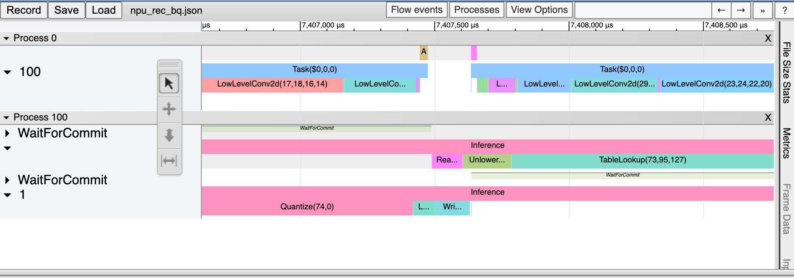
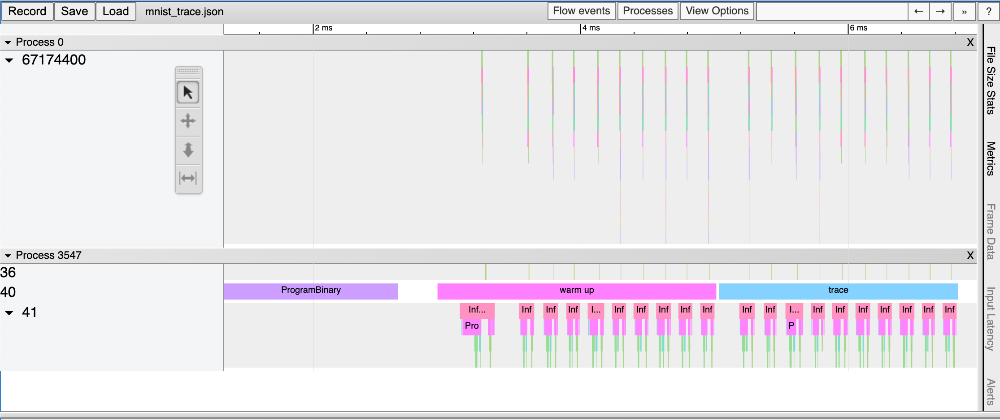

.. _Profiling:

***********************************
성능 프로파일링
***********************************

많은 DNN 응용에서 낮은 지연시간과 높은 처리 성능은 중요한 요소이다.
성능 최적화를 위해서는 모델 개발자나 ML 엔지니어가 모델의 성능을 이해하고 병목지점을 분석할 수 있어야 한다.
이를 위해 FuriosaAI SDK는 프로파일링 도구를 제공한다.

트레이스 분석 (Trace Analysis)
---------------------------------------------------
트레이스 분석은 모델의 추론 작업을 실제로 실행 시키고 측정한 구간 별 실행 시간을 구조적 데이터(structured)로 제공한다.
또한 데이터를 크롬 웹브라우져(Chrome Web Browser)의
`Trace Event Profiling Tool <https://www.chromium.org/developers/how-tos/trace-event-profiling-tool/>`_
기능을 이용해 시각화 할 수 있다.

트레이스 생성은 구간 별 시간을 측정하고 파일로 결과를 쓰기 때문에 작지만 실행 시간 오버헤드를 유발한다.
따라서 기본 설정으로는 활성화 되어 있지 않으며 아래 두 가지 방법을 통해 트레이스를 생성할 수 있다.

환경 변수를 통한 트레이스 생성 활성화
============================================================
``FURIOSA_PROFILER_OUTPUT_PATH`` 에 트레이스 결과가 쓰여질 파일의 경로를 설정 하면
트레이스 생성을 활성화 할 수 있다. 이 방법은 작성된 코드를 전혀 변경하지 않고
트레이스를 활성화할 수 있다는 장점이 있다. 반면, 측정하기 윈하는 구간이나 측정 연산의 카테고리를 더 세밀하게 설정 할 수 없다는
한계가 있다.

.. code-block:: sh

    cd furiosa-sdk/examples/inferences
    export FURIOSA_PROFILER_OUTPUT_PATH=`pwd`/tracing.json
    ./image_classification.sh ../assets/images/car.jpeg

    ls -l ./tracing.json
    -rw-r--r--@ 1 furiosa  furiosa  605054 Jun  15 02:02 tracing.json

위와 같이 환경변수를 통해 설정하면 환경변수 값에 설정된 경로에 JSON 파일이 쓰여진다.
크롬 브라우져에서 주소창에서 ``chrome://tracing`` 주소를 입력하면 트레이스 뷰어가
시작된다. 트레이스 뷰어에서 왼쪽 상단에 ``Load`` 버튼을 누르고 저장된 파일 (위의 예에서는 ``tracing.json``)
파일을 선택하면 트레이스 결과를 볼 수 있다.

..
  for bottom margin of the above image

\

프로파일러 컨텍스트를 이용한 트레이스 생성 활성화
============================================================
Python 코드에서 프로파일러 컨텍스트(Profiler Context)를 정의하는 것으로도 트레이스 생성을 활성화할 수 있다.
이 방법은 환경 변수를 통한 트레이스 활성화 방법과 비교하여 다음과 같은 장점을 가진다.

* Python 인터프리터 또는 Jupyter Notebook와 같은 인터렉티브한 환경에서 바로 트레이스를 활성화 할 수 있다.
* 실행 구간에 레이블을 붙일 수 있다.
* 측정을 원하는 연산 카테고리의 선택적으로 측정할 수 있다.

.. code-block:: python

    from furiosa.runtime import session, tensor
    from furiosa.runtime.profiler import profile

    with open("mnist_trace.json", "w") as output:
        with profile(file=output) as profiler:
            with session.create("MNISTnet_uint8_quant_without_softmax.tflite") as sess:
                input_shape = sess.input(0)

                with profiler.record("warm up") as record:
                    for _ in range(0, 10):
                        sess.run(tensor.rand(input_shape))

                with profiler.record("trace") as record:
                    for _ in range(0, 10):
                        sess.run(tensor.rand(input_shape))

위는 프로파일링 컨텍스트를 활용한 코드 예제이다. 위 Python 코드가 실행되고 나면 `mnist_trace.json` 파일이 생성되며
트레이스 결과는 아래 그림과 같이 'warm up'과 'trace' 레이블이 붙는다.

.. _PandasProfilingAnalysis:

Pandas DataFrame을 이용한 트레이스 분석
============================================================
측정한 트레이싱 데이터를 Chrome Trace Format으로 출력하여 시각화 하는 방법 외에도
데이터 분석에 많이 사용되는 Pandas의 DataFrame으로 표현하고 사용할 수 있다.
이 방법은 Chrome Trace Format과 비교하여 다음과 같은 장점을 가진다.

* Python Interpreter 또는 Jupyter Notebook 등의 interactive shell에서 바로 사용할 수 있다.
* 기본적으로 제공되는 reporting 함수 외에도 사용자가 직접 DataFrame에 접근하여 분석 작업을 수행할 수 있다.

.. code-block:: python

    from furiosa.runtime import session, tensor
    from furiosa.runtime.profiler import RecordFormat, profile

    with profile(format=RecordFormat.PandasDataFrame) as profiler:
        with session.create("MNISTnet_uint8_quant_without_softmax.tflite") as sess:
            input_shape = sess.input(0)

            with profiler.record("warm up") as record:
                for _ in range(0, 2):
                    sess.run(tensor.rand(input_shape))

            with profiler.record("trace") as record:
                for _ in range(0, 2):
                    sess.run(tensor.rand(input_shape))

    profiler.print_summary() # (1)

    profiler.print_inferences() # (2)

    profiler.print_npu_executions() # (3)

    profiler.print_npu_operators() # (4)

    profiler.print_external_operators() # (5)

    df = profiler.get_pandas_dataframe() # (6)
    print(df[df["name"] == "trace"][["trace_id", "name", "thread.id", "dur"]])

위는 프로파일링 컨텍스트의 형식을 PandasDataFrame으로 지정한 코드 예제이다.

``(1)`` 라인이 실행되면 아래와 같이 수행 결과의 요약 정보가 출력된다.

.. code-block::

    ================================================
      Inference Results Summary
    ================================================
    Inference counts                : 4
    Min latency (ns)                : 258540
    Max latency (ns)                : 650018
    Mean latency (ns)               : 386095
    Median latency (ns)             : 317912
    90.0 percentile latency (ns)    : 564572
    95.0 percentile latency (ns)    : 607295
    97.0 percentile latency (ns)    : 624384
    99.0 percentile latency (ns)    : 641473
    99.9 percentile latency (ns)    : 649163

``(2)`` 라인이 실행되면 아래와 같이 하나의 Inference 요청 단위로 소요된 시간 정보가 출력된다.

.. code-block::

                                trace_id           span_id  thread.id     dur
    40   daf4d8ed300bc4f93901a978111b44f9  d5ac7df24cfd0408         45  650018
    81   02e6fb6504e6f7a1312272077a2ca480  313be2a0fb70dc4f         45  365199
    124  713e7a122436acbeeafd1339499a7bed  f4402ab5ea873f46         45  258540
    173  7e754c14f342d3eb3f4efbc615d15d8a  4f67a754e72e2211         45  270625

``(3)`` 라인이 실행되면 아래와 같이 NPU의 Execution 단위로 소요된 시간 정보가 출력된다.

.. code-block::

                              trace_id           span_id  pe_index  execution_index  NPU Total  NPU Run  NPU IoWait
    0  e3917c06e01d136ddb98299da74748d8  1b99d7c6574c1c29         0                0      10902     8559        2343
    1  a867049bb2db14e62cebe3dc18546923  f5cd3ba0d885fab4         0                0      10901     8557        2344
    2  05bfa81f1579ac8089ac75588f36a747  e7e847b44ce11d28         0                0      10997     8557        2440
    3  438df7d9beb7fb8c60daaeffbb2c7e76  d2c20e3d9daf21be         0                0      10900     8555        2345

``(4)`` 라인이 실행되면 아래와 같이 Operator 단위로 소요된 시간 정보가 출력된다.

.. code-block::

                            average elapsed(ns)  count
    name
    LowLevelConv2d                   1226.187500     16
    LowLevelDepthwiseConv2d           757.333333     12
    LowLevelPad                       361.416667     12
    LowLevelMask                      116.500000      8
    LowLevelExpand                      3.000000      8
    LowLevelReshape                     3.000000     68
    LowLevelSlice                       3.000000      8

``(5)`` 라인이 실행되면 아래와 같이 CPU에서 동작하는 Operator들에서 소요된 시간 정보가 출력된다.

.. code-block::

                                trace_id           span_id  thread.id        name  operator_index    dur
    2    daf4d8ed300bc4f93901a978111b44f9  704e2c8ece98e29e         45    Quantize               0  42929
    3    daf4d8ed300bc4f93901a978111b44f9  4a304c8c46be707a         45       Lower               1  72999
    34   daf4d8ed300bc4f93901a978111b44f9  cff0f3268f26423d         45     Unlower               2  31812
    36   daf4d8ed300bc4f93901a978111b44f9  b3a90233e6eb90f8         45  Dequantize               3   4895
    54   02e6fb6504e6f7a1312272077a2ca480  920c7170893cb202         45    Quantize               0  14085
    55   02e6fb6504e6f7a1312272077a2ca480  b2508624adaf01a1         45       Lower               1  32360
    75   02e6fb6504e6f7a1312272077a2ca480  ed6fc23c0a7cc81e         45     Unlower               2  15655
    78   02e6fb6504e6f7a1312272077a2ca480  e2d61265a1fe0ad6         45  Dequantize               3   6128
    96   713e7a122436acbeeafd1339499a7bed  20473c3a26d91593         45    Quantize               0   4400
    100  713e7a122436acbeeafd1339499a7bed  f71676c0868f1a34         45       Lower               1  28714
    118  713e7a122436acbeeafd1339499a7bed  dff936584542ee83         45     Unlower               2  12675
    121  713e7a122436acbeeafd1339499a7bed  9d2eaf76f1a6d156         45  Dequantize               3  12227
    138  7e754c14f342d3eb3f4efbc615d15d8a  0df3b383e59e5322         45    Quantize               0   6631
    142  7e754c14f342d3eb3f4efbc615d15d8a  c15504b489f56503         45       Lower               1  11694
    170  7e754c14f342d3eb3f4efbc615d15d8a  cb8f9199904c6065         45     Unlower               2  17573
    171  7e754c14f342d3eb3f4efbc615d15d8a  90c1af4de00eebc2         45  Dequantize               3  16021

``(6)`` 라인을 실행하면 코드에서 DataFrame에 접근하고 사용자가 직접 분석할 수 있다.

.. code-block::

                                trace_id   name  thread.id     dur
    150  ec3dd3d28baf03adc6a1ddd5efe319bc  trace         44  778887

\

