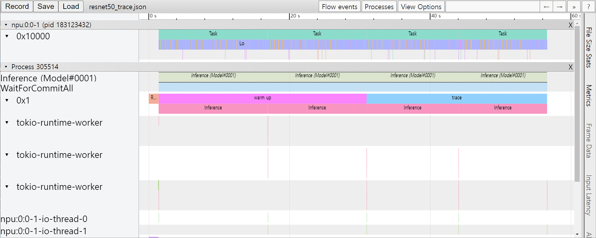

.. _Profiling:

***********************************
성능 프로파일링
***********************************

많은 DNN 응용에서 낮은 지연시간과 높은 처리 성능은 중요한 요소이다.
성능 최적화를 위해서는 모델 개발자나 ML 엔지니어가 모델의 성능을 이해하고 병목지점을 분석할 수 있어야 한다.
이를 위해 FuriosaAI SDK는 프로파일링 도구를 제공한다.

트레이스 분석 (Trace Analysis)
===========================================================
트레이스 분석은 모델의 추론 작업을 실제로 실행 시키고 측정한 구간 별 실행 시간을 구조적 데이터(structured)로 제공한다.
또한 데이터를 크롬 웹브라우져(Chrome Web Browser)의
`Trace Event Profiling Tool <https://www.chromium.org/developers/how-tos/trace-event-profiling-tool/>`_
기능을 이용해 시각화 할 수 있다.

트레이스 생성은 구간 별 시간을 측정하고 파일로 결과를 쓰기 때문에 작지만 실행 시간 오버헤드를 유발한다.
따라서 기본 설정으로는 활성화 되어 있지 않으며 아래 두 가지 방법을 통해 트레이스를 생성할 수 있다.

.. _ProfilerEnabledByEnv:

환경 변수를 통한 트레이스
============================================================
``FURIOSA_PROFILER_OUTPUT_PATH`` 에 트레이스 결과가 쓰여질 파일의 경로를 설정 하면
트레이스 생성을 활성화 할 수 있다. 이 방법은 작성된 코드를 전혀 변경하지 않고
트레이스를 활성화할 수 있다는 장점이 있다. 반면, 측정하기 윈하는 구간이나 측정 연산의 카테고리를 더 세밀하게 설정 할 수 없다는
한계가 있다.

.. code-block:: sh

    git clone https://github.com/furiosa-ai/furiosa-sdk
    cd furiosa-sdk/examples/inferences
    export FURIOSA_PROFILER_OUTPUT_PATH=`pwd`/tracing.json
    ./image_classify.py ../assets/images/car.jpg

    ls -l ./tracing.json
    -rw-r--r-- 1 furiosa furiosa 456493 Jul 27 17:56 ./tracing.json

위와 같이 환경변수를 통해 설정하면 환경변수 값에 설정된 경로에 JSON 파일이 쓰여진다.
크롬 브라우져에서 주소창에서 ``chrome://tracing`` 주소를 입력하면 트레이스 뷰어가
시작된다. 트레이스 뷰어에서 왼쪽 상단에 ``Load`` 버튼을 누르고 저장된 파일 (위의 예에서는 ``tracing.json``)
파일을 선택하면 트레이스 결과를 볼 수 있다.

.. image:: ../../../imgs/tracing.png
  :alt: Tracing
  :class: with-shadow
  :align: center
  :width: 600

..
  for bottom margin of the above image

\

.. _ProfilerEnabledByContext:

프로파일러 컨텍스트를 이용한 트레이스
============================================================
Python 코드에서 프로파일러 컨텍스트(Profiler Context)를 정의하는 것으로도 트레이스 생성을 활성화할 수 있다.
이 방법은 환경 변수를 통한 트레이스 활성화 방법과 비교하여 다음과 같은 장점을 가진다.

* Python 인터프리터 또는 Jupyter Notebook와 같은 인터렉티브한 환경에서 바로 트레이스를 활성화 할 수 있다.
* 실행 구간에 레이블을 붙일 수 있다.
* 원하는 연산 카테고리를 선택하여 측정할 수 있다.

.. include:: ../../../../examples/profiler/simple.py
    :code:

위는 프로파일링 컨텍스트를 활용한 코드 예제이다. 위 Python 코드가 실행되고 나면 `mnist_trace.json` 파일이 생성되며
트레이스 결과는 아래 그림과 같이 'warm up'과 'trace' 레이블이 붙는다.

\

.. _TemporarilyDisablingProfiler:

프로파일러 컨텍스트의 일시적 중단/재개
------------------------------------------------------------
장시간 실행되는 코드를 트레이스하는 것은 다음과 같은 문제점들을 야기할 수 있다.

* 트레이스 결과물 저장을 위해 많은 디스크 공간이 필요해지고, 결과물 공유가 어려워진다.
* 트레이스를 시각화했을 때 관찰하고자 하는 작업들을 식별하기 어려워지고, 별도로 데이터를 파싱 하는 등의 추가 작업이 필요하다.
* 트레이스 결과물 생성에 많은 시간이 소요된다.

이러한 문제를 해결하기 위해 컨텍스트 내에서 일시적으로 프로파일러를 중단/재개 할 수 있는 기능을 제공한다.
사용자는 프로파일링하기 원치 않는 작업들을 제외함으로써 불필요한 오버헤드를 최소할 수 있다.

아래는 프로파일러 중단/재개 기능을 사용한 예제로 ``profile.pause`` 와 ``profile.resume`` 사이의 ``warm up`` 추론들에 대한 트레이스는 생성되지 않는다.

.. include:: ../../../../examples/profiler/temporary_disable.py
    :code:

.. _PandasProfilingAnalysis:

Pandas DataFrame을 이용한 트레이스 분석
------------------------------------------------------------
측정한 트레이싱 데이터를 Chrome Trace Format으로 출력하여 시각화 하는 방법 외에도
데이터 분석에 많이 사용되는 Pandas의 DataFrame으로 표현하고 사용할 수 있다.
이 방법은 Chrome Trace Format과 비교하여 다음과 같은 장점을 가진다.

* Python Interpreter 또는 Jupyter Notebook 등의 interactive shell에서 바로 사용할 수 있다.
* 기본적으로 제공되는 reporting 함수 외에도 사용자가 직접 DataFrame에 접근하여 분석 작업을 수행할 수 있다.

.. include:: ../../../../examples/profiler/trace_with_dataframe.py
    :code:

위는 프로파일링 컨텍스트의 형식을 PandasDataFrame으로 지정한 코드 예제이다.

``(1)`` 라인이 실행되면 아래와 같이 수행 결과의 요약 정보가 출력된다.

.. code-block::

    ================================================
      Inference Results Summary
    ================================================
    Inference counts                : 4
    Min latency (ns)                : 1584494
    Max latency (ns)                : 3027309
    Mean latency (ns)               : 2136984
    Median latency (ns)             : 1968066
    90.0 percentile Latency (ns)    : 2752525
    95.0 percentile Latency (ns)    : 2889917
    97.0 percentile Latency (ns)    : 2944874
    99.0 percentile Latency (ns)    : 2999831
    99.9 percentile Latency (ns)    : 3024561

``(2)`` 라인이 실행되면 아래와 같이 하나의 추론 요청 단위로 소요된 시간 정보가 출력된다.

.. code-block::

    ┌──────────────────────────────────┬──────────────────┬───────────┬─────────┐
    │ trace_id                         ┆ span_id          ┆ thread.id ┆ dur     │
    ╞══════════════════════════════════╪══════════════════╪═══════════╪═════════╡
    │ 7cf3d3b7439cf4c3fac1a47998783102 ┆ 403ada67f1d8220e ┆ 1         ┆ 3027309 │
    │ 16d65f6f8f1db256d0f39953855dea72 ┆ 78b065c19c3675ef ┆ 1         ┆ 2111363 │
    │ d0534e3a9f19edadab81954ad28ab44f ┆ 9a7addaf0f28c9fe ┆ 1         ┆ 1824769 │
    │ 70512188522f45b87cfe4f545de3cf2c ┆ c75f697f8e72d333 ┆ 1         ┆ 1584494 │
    └──────────────────────────────────┴──────────────────┴───────────┴─────────┘

``(3)`` 라인이 실행되면 아래와 같이 NPU의 Execution 단위로 소요된 시간 정보가 출력된다.

.. code-block::

    ┌──────────────────────────────────┬──────────────────┬──────────┬─────────────────┬───────────┬─────────┬──────────────────────┐
    │ trace_id                         ┆ span_id          ┆ pe_index ┆ execution_index ┆ NPU Total ┆ NPU Run ┆ NPU IoWait           │
    ╞══════════════════════════════════╪══════════════════╪══════════╪═════════════════╪═══════════╪═════════╪══════════════════════╡
    │ 8f6fce6c0e52b4735cae3379732a0943 ┆ 3e1e4a76523cbf89 ┆ 0        ┆ 0               ┆ 119145    ┆ 108134  ┆ 18446744073709540605 │
    │ 195366613b1da9b0350c0a3c2a608f42 ┆ 07dff2e92172fabd ┆ 0        ┆ 0               ┆ 119363    ┆ 108134  ┆ 18446744073709540387 │
    │ 3b65b8fa3eabfaf8f815ec9f41fcc7d9 ┆ 639a366a7f932a23 ┆ 0        ┆ 0               ┆ 119157    ┆ 108134  ┆ 18446744073709540593 │
    │ e48825df32a07e5559f7f50048c08e1f ┆ ecaab4915bfda725 ┆ 0        ┆ 0               ┆ 119219    ┆ 108134  ┆ 18446744073709540531 │
    └──────────────────────────────────┴──────────────────┴──────────┴─────────────────┴───────────┴─────────┴──────────────────────┘

``(4)`` 라인이 실행되면 아래와 같이 연산자(Operator) 단위로 소요된 시간 정보가 출력된다.

.. code-block::

    ┌─────────────────────────┬──────────────────────┬───────┐
    │ name                    ┆ average_elapsed (ns) ┆ count │
    ╞═════════════════════════╪══════════════════════╪═══════╡
    │ LowLevelConv2d          ┆ 5327.8               ┆ 60    │
    │ LowLevelDepthwiseConv2d ┆ 1412.285714          ┆ 56    │
    │ LowLevelPad             ┆ 575.785714           ┆ 56    │
    │ LowLevelTranspose       ┆ 250.0                ┆ 4     │
    │ LowLevelReshape         ┆ 2.0                  ┆ 240   │
    │ LowLevelSlice           ┆ 2.0                  ┆ 12    │
    │ LowLevelExpand          ┆ 2.0                  ┆ 16    │
    └─────────────────────────┴──────────────────────┴───────┘

``(5)`` 라인이 실행되면 아래와 같이 CPU에서 실행된 연산자(Operator) 들에서 소요된 시간 정보가 출력된다.

.. code-block::

    ┌──────────────────────────────────┬──────────────────┬───────────┬────────────┬────────────────┬────────┐
    │ trace_id                         ┆ span_id          ┆ thread.id ┆ name       ┆ operator_index ┆ dur    │
    ╞══════════════════════════════════╪══════════════════╪═══════════╪════════════╪════════════════╪════════╡
    │ e7ab6656cc090a8d05992a9e4683b8b7 ┆ 206a1d6f351ca4b1 ┆ 40        ┆ Quantize   ┆ 0              ┆ 136285 │
    │ 03636fd6c7dbc42f0a9dd29a7283d3fc ┆ f636740983e095a6 ┆ 40        ┆ Lower      ┆ 1              ┆ 133350 │
    │ c9a0858f7e0885a976f51c6cb57d3e0f ┆ bb6c84f88e453055 ┆ 40        ┆ Unlower    ┆ 2              ┆ 44775  │
    │ 8777c67ad9fe597139bbd6970362c2fc ┆ 63bac982c7b98aba ┆ 40        ┆ Dequantize ┆ 3              ┆ 14682  │
    │ 98aeba2a25b0525166b6a4065ab01774 ┆ 34ccd560571d733f ┆ 40        ┆ Quantize   ┆ 0              ┆ 45465  │
    │ 420525dc13ba9624083e0a276f7ee718 ┆ 9f6d342da5eb86bc ┆ 40        ┆ Lower      ┆ 1              ┆ 152748 │
    │ cb67393f6949bbbb396053c1e00931ff ┆ 2d724fa6ab8ca024 ┆ 40        ┆ Unlower    ┆ 2              ┆ 67140  │
    │ 00424b4f02039ae0ca98388a964062b0 ┆ a5fb9fbd5bffe6a6 ┆ 40        ┆ Dequantize ┆ 3              ┆ 32388  │
    │ d7412c59d360067e8b7a2508a30d1079 ┆ 8e426d778fa95722 ┆ 40        ┆ Quantize   ┆ 0              ┆ 71736  │
    │ 6820acf9345c5b373c512f6cd5edcbc7 ┆ 2d787c2df381f010 ┆ 40        ┆ Lower      ┆ 1              ┆ 311310 │
    │ 84d24b02a95c63c3e40f7682384749e4 ┆ 1236a974a619ff1a ┆ 40        ┆ Unlower    ┆ 2              ┆ 51930  │
    │ 8d25dff1cfd6624509cbf95503e93382 ┆ 673efb3bfb8deac6 ┆ 40        ┆ Dequantize ┆ 3              ┆ 12362  │
    │ 4cc60ec1eee7d9f3cdd290d07b303a18 ┆ e7903b0a584d6388 ┆ 40        ┆ Quantize   ┆ 0              ┆ 56736  │
    │ c5f04d9fea26e5b52c6ec5e5406775fc ┆ 701118dabd065e6f ┆ 40        ┆ Lower      ┆ 1              ┆ 265447 │
    │ c5fdfb9cf454da130148e8e364eeee93 ┆ 5cf3750def19c6e8 ┆ 40        ┆ Unlower    ┆ 2              ┆ 35869  │
    │ e1e650d23061140404915f1df36daf9c ┆ ddd76ff19b5cd713 ┆ 40        ┆ Dequantize ┆ 3              ┆ 14688  │
    └──────────────────────────────────┴──────────────────┴───────────┴────────────┴────────────────┴────────┘

``(6)`` 라인을 실행하면 코드에서 DataFrame에 접근하고 사용자가 직접 분석할 수 있다.

.. code-block::

                                trace_id   name  thread.id       dur
    487  f3b158734e3684f2e043ed41309c4c2d  trace          1  11204385

\

