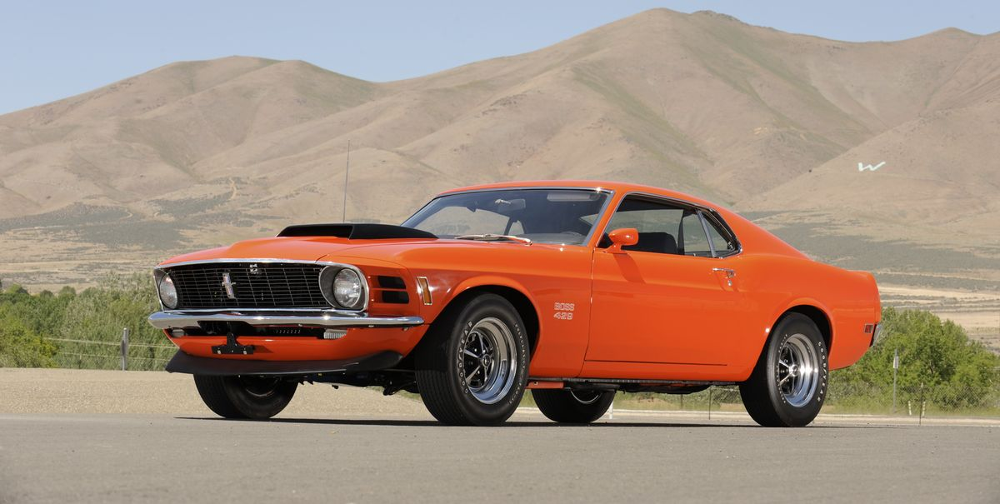

# Examples of FuriosaAI NPU SDK Python Runtime

This contains examples of FuriosaAI NPU Python SDK

## Preliminaries
* [FuriosaAI NPU SDK insatllation](https://furiosa-ai.github.io/renegade-manual/sdk/latest/ko/installation/index.html)
* Input model must be quantized via FuriosaAI Quantizer. See [FuriosaAI NPU Python SDK Quantizer Examples](../furiosa-sdk-quantizer)

## Setup
```
git clone https://github.com/furiosa-ai/furiosa-sdk
cd furiosa-sdk/examples/furiosa-sdk-runtime
pip install -r requirements.txt
```

## Image Classification using furiosa.runtime.Session

The following example tries to classify the object on the following image:



You can also try to use other images. `image_classify.py` internally 1) loads an image classification model located in `models` folder, 2) compile the model, and 3) classify an object.

The compilation can take some time up to tens of secs. In most production environments, you need to load a model only once when you start your application and service. So, the first compilation time wouldn't matter in most cases.

```
$ ./image_classify.py ../assets/images/car.jpg

INFO:furiosa.runtime._api.v1:successfully loaded dynamic library libnux.so.1.0.0
[1/6] 🔍   Compiling from tflite to dfg
Done in 0.011475525s
[2/6] 🔍   Compiling from dfg to ldfg
▪▪▪▪▪ [1/3] Splitting graph...Done in 35.824135s
▪▪▪▪▪ [2/3] Lowering...Done in 1.840462s
▪▪▪▪▪ [3/3] Precalculating operators...Done in 1.4879146s
Done in 39.153694s
[3/6] 🔍   Compiling from ldfg to cdfg
Done in 0.000241224s
[4/6] 🔍   Compiling from cdfg to gir
Done in 0.02475848s
[5/6] 🔍   Compiling from gir to lir
Done in 0.000917372s
[6/6] 🔍   Compiling from lir to enf
Done in 0.022692025s
✨  Finished in 39.228256s
Model has been compiled successfully
Model input and output:
Inputs:
{0: TensorDesc: shape=(1, 224, 224, 3), dtype=uint8, format=NHWC, size=150528, len=150528}
Outputs:
{0: TensorDesc: shape=(1, 1, 1, 1001), dtype=uint8, format=NHWC, size=1001, len=1001}
None
Prediction elapsed 2.10 secs
[Top 5 scores:]
sports car: 155
pickup: 152
car wheel: 148
convertible: 147
jeep: 142
```
